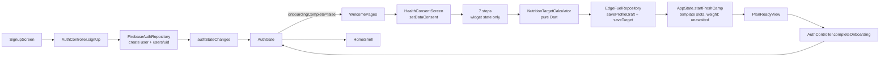
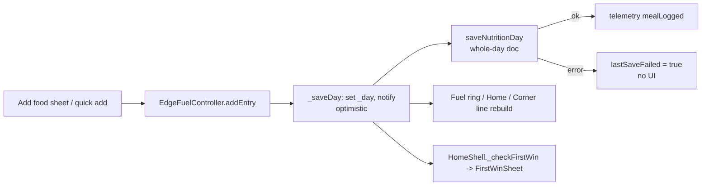
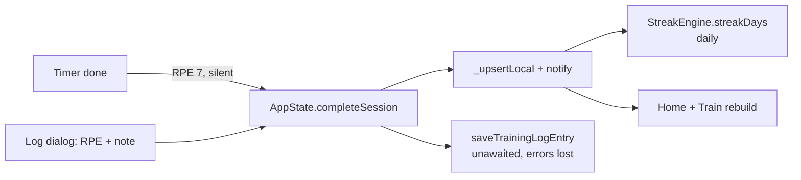

# Fighter Edge: product, UX, design and architecture audit (2026-10-04)

Read-only audit. No code was changed.

## How this audit was done

| | |
|---|---|
| **Code audited** | `origin/main` at `578c636` (PR #28), in a separate worktree. The owner's checkout (`feat/ai-eval-and-camp-domain`) is 73 commits behind main, so it was not used. File:line references below point at `578c636`. |
| **Not merged yet, so not counted as fixed** | PRs #29 contrast, #30 login validation, #31 accessible actions, #32 keyboard, #33 release crash, #34 reflow, #35 npm audit. |
| **Old screenshots** | `docs/audit_screenshots_20260917/` (43 files, 2026-09-17). These are **older than** the 2026-09-26 redesign slices (A–F in `UI_POLISH_AUDIT_20260925.md`), so many of their problems are already fixed. Each one is marked "fixed since" or "still true" below. |
| **New captures** | `docs/audit_screenshots_20261004/c01…c19` — a fresh account walked through the offline build (`lib/main_local.dart`, web, 390×844) on Sunday 2026-10-04: sign-up, welcome, consent, 7 onboarding steps, plan reveal, Home, tour, Train, Drills, Fuel, first meal, Profile, paywall, weight, fight setup, timer. |
| **Limits** | I viewed the old screenshots as images, but the image limit for this session ran out before the new captures. For the current build I judged layout from the live accessibility tree (every element's position and size) plus the code, which sets every colour, size and spacing through tokens. Pixel-level judgments of the current build are marked **Needs verification**. Nothing was tested on a real phone: no haptics, real gestures, TalkBack/VoiceOver, iOS or real purchases. Billing is not live in the offline build. |
| **Earlier audits read** | `/AUDIT.md` (09-24, production), `UI_UX_DESIGN_AUDIT_20260919.md`, `UI_POLISH_AUDIT_20260925.md`, `PRODUCT_PLAN_20260924.md`, Astra's `ui_review_20261001/REPORT.md` (PR #31). This audit doesn't repeat their findings unless they are still open and important. |

---

## 1. Executive summary

Fighter Edge has the **engineering of a serious product and the product
model of a prototype**.

The parts you can't see are very good: a pure-Dart nutrition engine with
safety limits, server-owned subscriptions, an AI that only explains
calculated facts, a documented token system, careful reduced-motion
support, 116 test files. After the 26 September clean-up, the visual
layer is also restrained and mostly free of template tricks.

The parts that decide whether people come back are weak:

1. **The training plan is not a plan.** Every account gets the first N of
   six hard-coded English sessions (`app_state.dart:560-606`). Goal,
   experience, discipline and fight date change nothing. A session is a
   title and a subtitle. "Start" opens a generic MMA round timer.
2. **The streak punishes following the plan.** It counts consecutive
   training *days* (`streak_engine.dart:37`). The plan has rest days, so a
   user who does exactly what the app says loses the streak and sees
   "Streak at risk" every weekend. The 09-24 product plan named this exact
   problem and decided on a weekly streak; it was never built.
3. **The week is a Monday–Sunday template matched by weekday strings.**
   A user who signs up on a Sunday (as in this audit) gets "Rest day" on
   Home and a Train week of five already-past sessions, all still shown
   as open (`c09`, `c11`).
4. **The differentiator is hidden.** Fight date, camp phases and a safe
   weight path are what competing apps lead with. Here they aren't asked
   in onboarding, and the entry sits below the fold on Home (`c09`).
5. **Home doesn't answer "what do I do now?"** on most days for a new
   user. A free user sees a daily upsell card that is bigger than the
   training hero's body text.

**Verdict:** the app looks credible and is engineered well, but it still
behaves like a set of good tools (timer, food log, weight tracker,
drills) rather than one coach that runs your week. Fix the plan model,
the week/streak model and Home first. Visual polish is no longer the
bottleneck.

**Current overall score: 5.5 / 10. After the recommended work: 8 / 10.**

---

## 2. What the product is

Fighter Edge is a mobile coach for amateur and semi-pro combat athletes
(MMA, boxing, Muay Thai, BJJ, wrestling) who train 3–6 times a week and
care about making weight. It puts four things in one dark, athletic app:
a weekly training plan with a round timer, a nutrition target with fast
food logging ("EdgeFuel"), weight tracking, and a fight-camp mode with a
countdown and a weight path that refuses unsafe cuts. A technique library
and a voice-led reaction drill add skill work.

It earns money from a Pro subscription ($7.99/month, $59.99/year, 7-day
trial decided on 09-24). Pro adds an AI "Corner Brief" (three lines a day
written from your training, food and weight), a coach chat, the full
drill and recipe libraries, and coaching cues between rounds. Free users
can watch one rewarded video a day for a full brief. The AI never invents
numbers: the app calculates, the AI explains.

The emotion it aims for is **"I have a corner"**: a calm, competent coach
who knows your fight date and tells you the one thing that matters today.
Dark ground, crimson accents, Oswald numerals and fight-card language
("camp", "corner", "weigh-in") support that. Its difference from MyFitnessPal is
safe weight-cut logic and fight-camp structure. Its difference from fight
apps like CutCoach is training and technique alongside food.

The UI supports that positioning **in style but not in behaviour**. It
looks like a corner; it doesn't act like one yet, because the plan doesn't
know you and the week doesn't adapt.

**Intended core loop (from `PRODUCT_PLAN_20260924.md`):**

`Fight date or goal → this week's plan → Home: one next action → log in seconds → Sunday review → next week adapts → weekly streak`

**Loop as built:**

`Generic 2–6 day template → Home: today's template slot or "Rest day" → tap Start (generic timer) or log a dialog → daily streak → nothing reviews or adapts the week`

| Loop step | Built? | Evidence |
|---|---|---|
| Fight date or goal shapes the plan | No | Goal and level are stored, never read (`grep experienceLevel` has no consumer). Fight date isn't in onboarding. |
| This week's plan | Template only | `_freshPlan`, `app_state.dart:560` |
| Home: one next action | Partly | `_SessionHero`, `dashboard_screen.dart:179`. Good on a training day; on rest days and day 0 the action is "Open camp" (a tab switch). |
| Log in seconds | Food: yes. Training: no | Food: quick add + undo. Training: stock `AlertDialog` with RPE slider (`training_camp_screen.dart:134`), or silent auto-log at RPE 7 from the timer (`round_timer_screen.dart:208-215`). |
| Feedback / reward | Food: yes. Training: weak | First-meal sheet, animated kcal ring. A finished session gets no moment. |
| Sunday review, adaptation | Not built | No code (`grep -i "camp review"`: 0 files). |
| Weekly streak | Not built | The streak is daily (`streak_engine.dart:37-69`). |

The loop closes for **food** and stays open for **training** and for
**the week**.

---

## 3. Strongest parts (protect these)

| Strength | Why it matters | Evidence |
|---|---|---|
| Deterministic, safety-first nutrition engine | Trustworthy numbers; AI can't make them up | `lib/features/edge_fuel/domain/` is pure Dart; ISSN cut limits; adult screening; `NutritionTargetCalculator` |
| Server-owned entitlements | The client can't grant itself Pro | `firestore.rules`: `billingFieldsUnchanged()`; `AuthController.startProCheckout` waits for the webhook |
| AI as explainer, with validation and quotas | Low risk, bounded cost | `functions/src/validate.ts`, `quota.ts`, `aiFacts.ts`; consent sheet before first use |
| Token-based design system with documented contrast | Consistency is cheap to enforce | `AppColors` (roles, ramps, "text-safe" notes), `AppType` (10 roles, 12 px floor), `Insets`, `Radii`, `MotionTokens` |
| Identity: Oswald + Barlow, crimson on near-black, gold only for Pro | Looks like a fight product, not a SaaS dashboard | `app_typography.dart:5-19` |
| Motion restraint and reduced-motion support | No AI-slop motion | One `AnimationController` in the app; `PremiumReveal`, `FadeThrough`, `PressScale` all honour `disableAnimations` |
| Round timer engineering | Works with the phone in a bag, across lock screen | Wall-clock engine, wakelock, spoken calls, 10-second warning, screen-reader announcements (`round_timer_screen.dart:87-234`) |
| Food logging feedback | Fast, reversible, satisfying | Quick add, haptic, Undo SnackBar, animated "kcal left" (`nutrition_screen.dart:117-161`, `AnimatedCount`) |
| First-week checklist reads real state | Can't claim progress the user hasn't made | `first_week_checklist.dart:16-21` |
| Free Corner Brief line | Specific, calculated, useful: "Protein is today's gap: 106 g to go." | `c09` after first meal; `CornerBriefCalculator` |
| Honest copy about limits | Builds trust | Paywall "this device will remember you asked", renewal disclosure, "Targets are estimates, not medical advice" |
| Test discipline | Safe to refactor | 116 test files, coverage gate 80%, goldens on Windows CI |

---

## 4. Weakest parts

1. **No real plan model.** Training is a static, English-only template
   (section 12).
2. **Wrong consistency model.** A daily streak and a calendar-week
   template, both blind to rest days and sign-up day (sections 9, 11).
3. **Home has no state machine.** It stacks blocks; it doesn't change
   shape for "train now", "done", "rest", "fight week" (section 11).
4. **Onboarding asks a lot and pays little.** 3 welcome pages, a consent
   wall and 7 steps before value. Answers aren't saved if the app closes.
   Two answers are collected and never used. The reveal shows four
   numbers and no week (section 10).
5. **Training has no session mode** for someone actually training
   (section 12).
6. **`AppState` is a 607-line god object** with dead legacy code and
   silent write failures (section 18).
7. **Half translated.** German is offered, but onboarding, Train, Profile,
   plan-ready and dialogs are hard-coded English (section 16).
8. **Monetization isn't ready.** No trial UI (0 matches for "trial"),
   legal pages are placeholders until URLs are set, and upsells sit at
   plan reveal and on Home every day (section 15).

---

## 5. End-to-end UX audit

### Information architecture

Four tabs: **Home · Train · Fuel · Profile.** The count is right for
this product. The contents are partly misplaced:

| Problem | Evidence | Fix |
|---|---|---|
| **Weight lives in Profile → Tools.** For a fight app, weight is a daily core action, not a tool. | `profile_screen.dart:107-129`, `c15` | Weigh-in becomes a Home quick action and part of the fight path. Keep the tracker reachable from the Home weight stat (already there). |
| **Fight camp has no home.** Its entry is a row below the fold on Home (`AddFightRow`, y≈825 of 844 in `c09`). | `dashboard_screen.dart:122` | Ask in onboarding. When a fight exists, it becomes the frame of Home (countdown in the header, phase in the Today card). |
| **Train has 4 sub-tabs with different jobs**: Week (plan), History (log), Drills (library), Reaction (game). | `training_camp_screen.dart:36-41` | Keep Week as Train's root. Move History into Week ("Past weeks"). Keep Drills. Make Reaction a drill type inside Drills, not a peer tab. |
| **Names drift**: tab "Fuel", header "NUTRITION", feature "EdgeFuel", target "EdgeFuel target"; tab "Home", header is a date, old string "Dashboard". | `app_en.arb:6,91`; `c13` | One user-facing word per thing: **Fuel**, **Home**, **Camp**, **Corner**. "EdgeFuel" is internal. |
| **Tab state is thrown away.** Switching tabs rebuilds the page (`home_shell.dart:155-168`, `FadeThrough`). Scroll position, Train's sub-tab and Fuel's segment reset every time. 0 `PageStorageKey`s in the app. | Code | `IndexedStack` (lazy) or `StatefulShellRoute.indexedStack`, plus `PageStorageKey` on lists. |

### Cognitive load hot spots

- **Onboarding step 6** (`onboarding_steps.dart:137-153`): the title asks
  "How many days can you train?", but the first control is a row of
  experience-level chips with no label. Two questions, one title.
- **Camp goal vs nutrition goal** (steps 1–2): "Get competition ready"
  plus "Maintain" is allowed; only "Lose weight safely" and "Gain muscle"
  sync (`onboarding_screen.dart:272-279`). Users answer the same idea twice.
- **Calorie formula step** (step 4): now plain ("Male physiology / Female
  physiology / Prefer not to say", `c06`→step 4) — fixed since the 09-17
  "Equation A uses the +5 offset" (`06b_step3_filled.png`). The title
  "Which formula fits your body?" still exposes the maths. Better:
  "Which body should we calculate for?"
- **Health consent** (`c04`): about 120 words in four blocks before the
  first question. Legally careful, but it reads like a contract. Layer it:
  one sentence plus a "What we store" disclosure.
- **"Why this target matters"** opens a stock `AlertDialog` with three
  generic sentences (`dashboard_screen.dart:241-254`). It explains
  calories in general, not *this* number.
- **Fuel week line on day 1**: "Fuel this week: 1 of 7 days logged, 0 on
  target, protein hit on 0 days" (`c09` after the first meal). It counts
  days before the account existed.

### Flow scores (could a new user act within 2–3 seconds?)

| Flow | Score | Why |
|---|---:|---|
| Login | 7 | Standard and clear (`c01`). Empty submit gives a general error until PR #30. Google mark is now official. |
| Sign-up | 7 | Four fields and a terms checkbox (`c02`). Confirm-password field is extra friction many apps have dropped; inline errors are good. |
| Welcome + consent | 5 | Three welcome pages are fine and say "About 2 minutes · 7 quick questions" (good). The consent wall and "Not now, sign out" are heavy. |
| Onboarding questions | 5 | Clear one-question screens, live preview line. But the button moves every step (below), unused questions, no fight date, no saving. |
| Plan reveal | 4 | Instant numbers with no "why", no week, no weight path; Pro upsell on the same screen (`c08`). |
| Home (day 0) | 4 | "Rest day" hero on day 0; upsell card larger than the hero's body; fight entry below the fold (`c09`). |
| Train | 4 | Week list is readable, but past sessions look open; Start = generic timer; no session content (`c11`, `c19`). |
| Fuel | 7 | Clear "kcal left" ring, quick add, undo, first-win moment. Empty-day logging button sits under the nav bar (`c13`, y=807). |
| Profile | 6 | Clean grouped list (`c15`). Mixes identity, subscription, tools, stats and sign-out; weight is buried here. |
| Paywall | 6 | Plain, honest, one plan choice, renewal text, restore. No trial, no free-vs-Pro contrast (`c16`). |
| Verification | 6 | Staged banners, resend cooldown, polling (code). The current screen wasn't captured. **Needs verification.** |
| First-use (tour + checklist) | 5 | Checklist is honest. "Take the 30-second tour" as a checklist item is busywork; the coach mark covers the content it explains (`c10`). |

**The moving Continue button.** Its top edge in the captures, per
onboarding step: 335, 498, 449, 524, 684, 377, 489 px. A thumb can't learn
where it is. Pin the primary action to the bottom safe area on every step.

---

## 6. UI and visual design audit

The 26 September slices fixed most of what the 09-17 screenshots show:
no background glow, flat primary button, quiet `AppCard` default, no
logo on every onboarding step, sentence-case buttons, official Google
mark. Compare `04_onboarding_step1.png` (logo, eyebrow, three nested
outlines, shadowed CTA) with `c05` (progress bar, question, chips,
preview line, CTA).

What still holds the visuals back (layout from the live tree, pixels
**need verification**):

| Area | Finding | Evidence |
|---|---|---|
| Hierarchy on Home | The hero uses `AppType.display` (52 px) for "Rest day", the largest type in the app outside the timer, to say there is nothing to do. Display size should be earned by a number or a task. | `dashboard_screen.dart:208`, `c09` (hero 247 px tall) |
| Density on Home | Day 0 viewport: name, goal, checklist, a 247 px hero, a 180–200 px Corner Brief card (mostly upsell), three stats. The one thing a fighter would set first (the fight) is off-screen. | `c09` |
| Three segmented-control styles | Train uses `FilterChips` pills, Fuel uses a radio-group segmented bar, weight tracker uses chip tabs, onboarding uses stock `ChoiceChip`s. | `training_camp_screen.dart:50`, `nutrition_screen.dart:555`, `c17`, `onboarding_widgets.dart:84-107` |
| Stock components next to branded ones | 8 stock `AlertDialog`s (session log, food entry, weight entry, target info, account deletion, fight confirm, reaction leave, settings) and 19 raw `SnackBar` constructions, beside custom sheets. | grep counts on `578c636` |
| Header systems | Tabs: collapsing uppercase large title. Pushed screens: centred uppercase 18 px title. Onboarding: no title, progress bar. Plan ready: 30 px sentence-case title. Four header languages. | `app_scaffold.dart:105-241` |
| Cards for everything in Train | Each session is a full `AppCard` with icon, three text lines and two circular buttons. Five cards fill the screen (`c11`). A dated list with one highlighted "today" row reads faster. | `training_camp_screen.dart:223-284` |
| Chips below touch size | Onboarding `ChoiceChip`s render 32 px tall (`c05`). Material may pad the hit area to 48. **Needs verification.** | `onboarding_widgets.dart:89` |
| Small text links | Paywall "Refresh purchase status", "Terms of Use", "Privacy Policy" are 32 px tall. | `c16` |
| Empty states | Train empty: one muted sentence, no action. Fuel empty day: a good "Start with something simple" block, but its button is below the fold. Weight Body Fat/Measurements tabs invite logging with no add action (Astra EMPTY-01). | `training_camp_screen.dart:108-115`, `c13`, `c17` |
| Loading states | Skeletons exist (31 uses) and the boot screen is branded. Good. | `widgets/skeleton.dart` |
| Error states | One boot failure text for every cause ("Check your connection"), with nothing logged (`main.dart:476-485`). Account deletion shows the raw exception (`delete_account_flow.dart:26`). | code |

**Where it feels…**
- **Premium:** round timer, reaction drill numerals, Fuel ring with
  animated count, Profile grouped list, paywall plan tiles.
- **Amateur:** stock dialogs for the two most frequent inputs (log
  session, add food manually); a weight tracker opened from Profile →
  Tools; the timer saying "ROUND TIMER" after you tapped "Start Striking".
- **Visually empty:** onboarding steps 1, 6 and 7 use under half the
  screen with the CTA floating mid-screen.
- **Under-designed:** the training session itself (title + subtitle is
  all there is).
- **Over-designed:** nothing major is left after 09-26.

---

## 7. AI-slop audit

Most of the obvious tells were removed on 09-26 (glows, gradient
buttons, icon tiles, nested cards, sparkle icons, eyebrows, uppercase
everywhere). What remains is subtler. It's in **behaviour and copy, not
decoration**:

| Tell | Where | Why it reads as generated | What a product designer does instead |
|---|---|---|---|
| **Fake personalization** | "Your first plan is ready" (step 7, *before* the plan is built) and "Your first Fighter Edge plan is ready" (`plan_ready_view.dart:65`) for a plan that is the same template for everyone | Users notice when "your plan" is identical for a beginner and a pro fighter | Generate a real plan, and show *why* it is theirs: "5 days · Striking-first because you picked Get competition ready · Rest Sat–Sun" |
| **Questions that change nothing** | Experience level, camp goal | The classic AI-built onboarding: ask a lot, use a little | Ask only what changes output; show what each answer changed |
| **Generic explainer** | "Calories support your goal. Protein supports recovery…" (`dashboardFuelExplanation`) | Applies to every app and every user | "2,240 kcal = about 2,740 to hold weight, minus 500 for ~0.5 kg/week." |
| **Motivational filler** | "Your camp, organised.", "Fuel that matches the work.", "Consistency beats an impossible plan." | Each is fine alone; together they read like a landing page | Keep one welcome page. Spend the words on showing the real week. |
| **Brand-word stacking** | "EdgeFuel target", "Corner Brief", "Corner Cues", "Open camp", "Your corner is reading your day…" | Internal names leak into UI; users must learn a vocabulary before getting value | Plain nouns first ("Food target", "Today's brief"), brand once |
| **Checklist that includes looking at the app** | "Take the 30-second tour" as a "win" | Busywork disguised as progress | Wins are real actions: first weigh-in, first meal, first session |
| **Same card shape repeated** | Train week: five identical cards with two round buttons each | Template grid, no hierarchy | A dated list; today large, past small, future plain |
| **Upsell as content** | Corner Brief free card every day on Home; "More training tools with Pro" on plan reveal | Monetization placed where the product's own voice should be | Earned moments: after a week of logging, at the Sunday review, when tapping a locked drill |

Not slop, and should stay: dark theme, condensed numerals, the red left
bar on a *real* next session, gold only for Pro, credited recipe photos,
the ring on Fuel.

---

## 8. Native / Apple-level feel

Present: press-scale feedback, restrained haptics (53 calls named by
intent), shared-element number heroes (weight), modal rise for the
paywall, fade-through for peers, reduced-motion paths, keep-awake timer,
spoken calls.

Absent or weak:

| Quality | Status | Evidence |
|---|---|---|
| State preservation | Missing across tabs | `home_shell.dart:155-168`; 0 `PageStorageKey` |
| Natural modal behaviour | Mixed: 8 stock `AlertDialog`s for input forms | §6 |
| Keyboard handling | Body-step inputs sit in a `ListView` with the CTA below; no "Next" field chaining verified. **Needs verification on device.** | `onboarding_steps.dart:199-241` |
| Primary action reach | CTAs float mid-screen in onboarding; Fuel's empty-day action under the nav bar | `c05`–`c07`, `c13` |
| Satisfying confirmations | Food: yes. Training completion: none (silent auto-log, or a dialog that closes). Weigh-in: none beyond the list. | `round_timer_screen.dart:203-215` |
| Continuity between screens | Start Striking → a screen titled "ROUND TIMER" with an MMA preset, unrelated to Striking | `c19` |
| Pull to refresh, swipe actions | None (0 `RefreshIndicator`, 0 `Dismissible`). Fine for Firestore streams; swipe-to-delete on food rows would be expected. | grep |
| Back behaviour | Onboarding is the gate's root with no `PopScope`; Android back likely leaves the app mid-setup and loses answers. **Needs verification.** | `onboarding_screen.dart:141` |
| Real device feel | Not reviewed (no device). | — |

---

## 9. "Does it feel alive?"

| Screen | Rating | Why |
|---|---|---|
| Login / Sign-up | Neutral | Appropriate for auth. |
| Welcome pages | Neutral | Page swipe with haptic; content static. |
| Onboarding questions | Mostly alive | The preview line updates as you answer ("5 days a week · Intermediate · Lose fat"). Good idea, worth making bigger. |
| Plan reveal | **Very static** | Numbers appear instantly; no build-up, no causality, no week. The moment that should feel like "this was made for me" is a receipt. |
| Home | Static → Neutral | It does react: after one meal, the brief line, kcal and checklist changed (`c09` before/after). But on day 0 and rest days the hero says nothing to do. No "since yesterday", no welcome back, no fight phase change. |
| Train week | **Static** | Five identical cards; completing a session ticks a line. No progress across the week. |
| Session (timer) | Alive | Phase colours, voice, haptics, 10-second call. But it ends in silence: no summary, no streak or week update moment. |
| Reaction drill | Alive | Stage numerals, voice cues, pause on background. |
| Drill library | Neutral | Studied/drilled/sharp progress is good; "0 of 17 drills sharp" for a new user reads as a debt. |
| Fuel | Mostly alive | Animated count, ring, undo, first-win sheet (which covers the Undo bar, Astra FUEL-02). |
| Weight | Neutral | "Add more weigh-ins to see a trend" until two entries; goal gap is useful (`c17`). |
| Profile | Static | Fine for settings; stats duplicate Home. |
| Paywall | Static | Fine. |

**Rule for fixes:** every motion must say *state, progress, cause or
reward*. The three highest-value ones:
1. Session complete: CTA turns into a done state, the week bar fills one
   segment, one success haptic, Home's hero switches to the next state.
2. Plan reveal: the week assembles day by day from the user's answers
   (real data, ~1.2 s, skippable), then the target and weight path.
3. Home after a log: the changed number counts (already done on Fuel;
   do the same on Home), and the brief line cross-fades.

---

## 10. Onboarding audit (one funnel)

**Funnel as built (current):** sign-up → 3 welcome pages → consent wall →
7 questions → plan ready (with Pro upsell) → Home. That's **12 screens**
before the first useful screen, plus a coach-mark tour.

| Step | Asks | Needed? | Used later? |
|---|---|---|---|
| 1 Camp goal | 5 chips | Partly (overlaps step 2) | Only shown as a subtitle on Home/Profile |
| 2 Nutrition goal | Lose / Maintain / Gain | Yes | Yes (target) |
| 3 Body | Age, height cm, weight kg, optional target | Yes | Yes. **No lb/ft input**, though Settings offers lb. |
| 4 Formula | Male / Female / Prefer not to say | Yes, fine | Yes |
| 5 Daily activity | 5 levels | Yes | Yes |
| 6 Level + days | Unlabelled level chips + day stepper | Days yes; level not used | Days only |
| 7 Review | Summary | Could be merged into the reveal | — |
| **Missing** | Discipline (asked later in Drills), fight date, preferred training days | **Yes** | Would drive plan, camp, Home |

**Emotional progression**

| Stage | Works? |
|---|---|
| Curiosity | Yes: welcome pages are short and say "2 minutes". |
| Commitment | Breaks: consent wall + "Not now, sign out" feels like a gate, not a promise. |
| Personalization | Breaks: the questions that would make it personal (discipline, fight) aren't asked; two that are asked do nothing. |
| Anticipation | Missing: no build-up; the review step already claims "Your first plan is ready." |
| Reward | Weak: four numbers, no week, upsell beside them, then a Home that says "Rest day". |

Likely user reaction today: **"This app is making me fill out a form."**

**Reliability:** all answers live in widget state
(`onboarding_screen.dart:41-56`). Closing the app on any step, or even on
the plan-ready screen (target already saved, onboarding not marked
complete), sends the user back to welcome page 1. "Skip detailed target
for now" is visible on every step, including after all data is entered.
The "Start my plan" button stays enabled while the target and camp are
being saved (busy flag only covers `completeOnboarding`), so a double tap
can submit twice. Effects look idempotent. **Needs verification.**

**Recommended funnel (6 questions, saved after each):**
1. What do you train? (multi-select: striking, wrestling, BJJ, MMA)
2. Have you got a fight booked? (date + weigh-in, or "Not yet")
3. Main goal right now (Make weight / Lose fat / Hold / Gain), merged
   camp and nutrition goal, defaulted from step 2
4. Body (age, height, weight; kg/lb toggle)
5. Body for the formula + day-to-day activity (one screen)
6. Which days can you train? (tap weekdays: gives count *and* dates)

Then a **real reveal**: the week with dates (starting today), the target
with one line of "why", and the weight path if there is a fight. Then
Home with **one action that's possible today** (log weight, or the first
session, or a 10-minute starter drill if today is a rest day).

---

## 11. Dashboard (Home) audit

**The 3-second test on day 0 (`c09`, Sunday):**

| Question | Answered? |
|---|---|
| Where do I stand? | Partly: name, goal, three zero stats. |
| What matters today? | No: "Rest day", and the next session (Mon) is tomorrow. |
| What should I do next? | Unclear: "Open camp" (tab switch), checklist collapsed, a 200 px upsell. |
| Am I progressing? | No: Sessions 0, Streak 0 days. |

**Block-by-block** (`dashboard_screen.dart:82-173`):

| Block | Verdict | Change |
|---|---|---|
| Date header | **Keep** | Good: says what day it is. |
| Name + goal | **Demote** | One small line, or remove (Profile has it). |
| First-week checklist | **Keep, change** | Real actions only; remove the tour item; when done, disappear (already does). |
| Fight countdown section | **Promote** | When a fight exists, it frames Home. |
| Session hero ("TODAY") | **Redesign** | A Today state machine (below). Display type only for a real task or a countdown. |
| Corner Brief card | **Merge** | The free calculated line belongs *inside* the Today card as "Coach note". Show the Pro upsell at most once a week, or after a meaningful log. |
| Verification banner | Keep | Fine; staged. |
| Streak-at-risk banner | **Redesign** | Only when a *planned* session was missed. |
| Dev message card | Keep | Rare. |
| Stats row (weight/sessions/streak) | **Demote / merge** | Weight becomes a "Weigh in" quick action with last value; sessions/streak become one "This week: 2 of 5" bar. |
| "Add your next fight" row | **Promote** (or move to onboarding) | Above the fold until set. |
| This week (day dots + fuel week) | **Merge** | Into the "This week" bar above. |
| Recent activity | **Remove from Home** | It's history; Train owns it. |

**Today states** (computed in pure Dart from the daily snapshot, one
primary action each):

| State | Hero | Primary action |
|---|---|---|
| Session planned today, not done | Session name, rounds, time | **Start session** |
| Session done today | "Done · RPE 7 · 45 min" + week bar | Log food / weigh in |
| Rest day (planned) | "Recovery day" + one recovery line | Log weigh-in (or "Light mobility, 10 min") |
| Missed planned session yesterday | "Yesterday's Wrestling is open" | Move to today / Mark done / Skip |
| Fight week / weigh-in day | Countdown + today's cut step | Open fight week plan |
| No plan | "Pick your training days" | Set up week |
| Day 0 | "Welcome, Sam. Start with today's weigh-in." | Log weigh-in |

---

## 12. Train audit

| Question | Answer | Evidence |
|---|---|---|
| Is today's workout obvious? | Only by its red play button; past days look the same as future ones. | `c11`, `training_camp_screen.dart:116-124` |
| Is starting obvious? | Yes (play button), but it starts a generic timer. | `c19`: "ROUND TIMER", MMA 5×5 preset, no session name |
| Is there a workout? | **No.** A session is `title + subtitle` ("Striking · Boxing fundamentals + combinations"). No rounds, drills or warm-up. | `TrainingSession` model; `app_state.dart:561-604` |
| Progression visible? | "WEEK 1" from the account's creation date; nothing else. | `training_camp_screen.dart:87-88` |
| Useful one-handed during training? | The timer is: big numerals, Start/Reset at y=562. | `c19` |
| Completion meaningful? | No. The timer silently logs "RPE 7, Completed from round timer". Logging by hand is a stock dialog with a slider. | `round_timer_screen.dart:208-215`, `training_camp_screen.dart:134-221` |
| Do free timer rounds / reaction drills count? | **No.** `TrainingSource.timer` and `.reaction` are never written, against the 09-24 plan ("Timer rounds and Reaction drills count toward the week"). | grep: only the icon switch reads them |
| Is it localized? | No: "WEEK", "Session history", "RPE", session titles and days are hard-coded English; day matching is `s.day.toLowerCase().startsWith('mon')`. | `training_camp_screen.dart:77-99` |

**Verdict:** Train is a list of labels and a timer, not a training
system. It doesn't feel built for someone mid-session.

**What it should be:** a dated week (today first) → a **session player**
with blocks (warm-up checklist → rounds with cues from the drill library
for that discipline → finisher) → a two-tap end (RPE as five big
buttons, optional note) → a completion screen that fills the week bar
→ back to Home in its "done" state.

---

## 13. Fuel audit

Fuel is the most complete system in the app.

| Question | Answer |
|---|---|
| Purpose clear? | Yes: ring says "2240 kcal left" (`c13`). |
| Remaining over raw? | Yes: remaining is the hero, macros as "28 / 134 g" bars. |
| Logging fast? | Yes for quick adds and search; manual entry is a stock dialog with six fields. |
| Common actions easy? | Header "+" (top right, hard to reach) and an inline "Add food" button that is **below the nav bar on an empty day** (y=807 vs nav at 788). |
| Feedback? | Haptic, "added" SnackBar with Undo, animated count, first-win sheet (which hides the Undo, FUEL-02). |
| Does it add tracking work? | Moderately: no "repeat yesterday's breakfast", no meal templates on Today (Meals tab exists). Food memory exists (`food_memory.dart`). |
| Hierarchy matches what users care about? | Mostly. "View fuel plan" and "Recipes that fit" sit inside the ring card, so the card is 442 px tall. |

Fixes: a bottom-anchored "Log food" action on Today; "Repeat yesterday"
and recent-food chips at the top of the sheet; swipe-to-delete with undo
on rows; replace the manual-entry dialog with the same sheet style; let
the first-win moment be inline so Undo stays reachable.

**Data note:** the whole day is one Firestore document, rewritten on
every change (`_saveDay`, `edge_fuel_controller.dart:305-324`). Two devices
(or offline + online) can overwrite each other's entries. Save failures
set `lastSaveFailed`, but nothing in the UI reads it (0 references), so
the user never learns a meal wasn't saved.

---

## 14. Profile audit

`c15`: identity, Subscription (one row), Tools (Round timer, Weight
tracker, Settings), Stats (sessions, streak, days/week), Sign out.

- **Works:** grouped rows, one gold accent, plain copy. This was the
  reference pattern for the 09-26 clean-up and it holds.
- **Doesn't:** it's a drawer for things that didn't find a home. Weight is
  a core loop action here. Stats repeat Home. "Current streak 0 days" uses
  a hard-coded plural ("1 days", COPY-01). Every label is hard-coded English
  (`profile_screen.dart:104-150`).
- **Change:** Profile = identity, subscription, settings, account. Weight
  moves to Home/Fight; the timer moves into Train (a "Free timer" entry);
  stats move to Train → History.

---

## 15. Premium / paywall audit

| Check | Status |
|---|---|
| Timing | Upsells at plan reveal (before any value), on Home daily (Corner Brief), on locked drills/recipes/coach (good, contextual). |
| Value before ask | Not enough: on day 0 the user has seen numbers, not coaching. |
| Clarity | Good: "Your corner, every day · One plan. Everything in Fighter Edge." Four benefits, each matching a real gated feature (`paywall_screen.dart:505-554`). |
| Pricing hierarchy | Annual first with "Best value", "About X / month", "Save about N%" (computed, not invented). Good. |
| Trial | **Missing.** Decided 09-24 ($7.99/$59.99, 7-day trial); no code mentions a trial. Must come from the store offer and be shown on the tile. |
| Free vs Pro boundary | Not shown. The user can't see what stays free. |
| Restore / manage | Present. |
| Legal | Renewal disclosure present; Terms/Privacy open hosted URLs only if `TERMS_URL`/`PRIVACY_URL` are set at build time, otherwise an in-app placeholder that says it "will be published here before public launch". |
| Trust | Good: "Secure checkout by Google Play or the App Store", purchase waits for the server. |
| Dark-pattern risk | Low. No fake timers, no pre-checked add-ons. |
| Waitlist (billing off) | Records interest only on the device and in consent-gated analytics. The user is told so, but the owner can't contact anyone from it. Owner decision: remove it, or collect an email with consent. |
| Purchase gating | Gated features are client-side for bundled content (drills, recipes ship in the app). Acceptable trade-off; the AI is gated server-side. |

**Has the product earned the ask?** Not at plan reveal. It will by the
end of week 1 if the Sunday review exists: "You did 4 of 5 sessions, hit
protein 3 days; here's what Pro would change for next week." That screen
is the best paywall trigger this product has, and it isn't built.

---

## 16. Product copy audit

| Where | Current | Problem | Suggested |
|---|---|---|---|
| Onboarding step 1 | "What should Fighter Edge build first?" | Product-centred, vague | "What's your main goal right now?" |
| Onboarding step 2 | "What should EdgeFuel optimize for?" | Internal brand + jargon | "What should your food do?" |
| Step 6 | (unlabelled level chips) | Missing question | "How experienced are you?" as its own label |
| Step 7 title | "Your first plan is ready." | Untrue before submit | "Check your answers" |
| All steps | "Skip detailed target for now" | Unclear what is skipped | "Skip food targets — set them later" (body steps only) |
| Plan ready | "Your first Fighter Edge plan is ready" | Repeats step 7; brand-heavy | "Your camp starts today" |
| Home hero CTA | "Open camp" | Vague; it's a tab switch | "See this week" |
| Target info | "Calories support your goal. Protein supports recovery…" | Generic | Explain this user's number (maintenance − deficit = target) |
| Home fuel week | "1 of 7 days logged" on day 1 | Counts days before sign-up | "1 day logged so far" until a full week exists |
| Profile | "Current streak 0 days" | Plural bug | Use the existing plural ARB key |
| Timer from a session | "ROUND TIMER" | Loses context | "STRIKING · Round 1 of 5" |
| Account deletion error | `'$e'` | Shows a raw exception | "Couldn't delete your account. Check your connection and try again." |
| Boot failure | "Check your connection and try again." for every cause | Can be wrong (e.g. the 10-04 missing-registrant build) | Keep the text, but log the error type; add "Contact support" after two retries |
| Brand words | EdgeFuel / Corner Brief / Corner Cues / camp | Vocabulary tax | Fuel, Today's brief, Round cues, Camp |

**Localization:** ARB has 501 keys in EN and DE, but at least 81
`Text('…')` literals and many string parameters bypass it: onboarding
(all steps), plan ready, welcome pages 1–2, Train, Profile, first-week
checklist, first-win sheet, dialogs. A German user switches language
mid-task (Astra L10N-01). Day matching on English abbreviations
(`'mon'`) couples logic to language.

---

## 17. Accessibility and ergonomics

**Strong base:** `AppAccessibility.minTouchTarget = 48`;
`adjustStyle`/`isLargeText` switch rows to columns (Home stats, plan
macros, Train rows); reduced-motion paths everywhere; timer phase changes
announced; contrast roles documented with ratios (`accentText` 4.83:1,
`primaryFill` 5.23:1).

**Open issues** (most already fixed in unmerged PRs):

| Issue | Status |
|---|---|
| Merged semantics (e.g. heading "NUTRITION Add food" with no separate button in the live tree) | Fixed in #31, unmerged |
| `PressScale` controls not keyboard-operable | Fixed in #32, unmerged |
| Labels clipped at 320 px / 200 % | Fixed in #34, unmerged |
| Floating label and timer contrast | Fixed in #29, unmerged |
| Floating label is ~10.5 px (TYPE-01) | Open |
| Onboarding chips 32 px visual height | Open. **Needs verification** of hit area |
| Paywall text links 32 px | Open |
| Primary action position moves per onboarding step | Open (thumb reach) |
| Fuel empty-day add button under the nav bar | Open |
| Android back on onboarding exits and loses answers | **Needs verification** |
| Real TalkBack/VoiceOver, landscape, tablet, small phone (320 pt) on device | Not tested |

---

## 18. Technical architecture audit

### Map

```text
lib/
  main.dart            boot: Firebase, App Check, consent, auth (4 s timeouts), providers
  main_local.dart      offline build: LocalAuthRepository + in-memory data
  routing/             go_router, flat routes; AuthGate at "/"; redirect + stack reset on session change
  controllers/         AuthController (auth + billing + verification + consent) 409 lines
  state/               AppState (weights, settings, legacy meals, plan, log, migration) 607 lines
                       FirstRunController, StreakController + StreakEngine (pure), LocaleController
  data/                DataRepository (Firestore / in-memory) for weights, meals(legacy), sessions, trainingLog
  features/
    edge_fuel/         domain (pure, calculators, policies, validation) · data (Firestore, assets) · ai · presentation
    fight_camp/        domain (weight path) · data · presentation (setup, path, week)
    daily_snapshot/    domain (pure) + builder from AppState/FightCamp/Fuel
    corner_brief/      domain + controller + card (free line, rewarded video, Pro AI)
  training/            round timer engine, reaction drills, drill catalog, taxonomy
  auth/ billing/ ads/ privacy/ notifications/ observability/ security/ legal/ l10n/
  theme/ widgets/      tokens + shared components
functions/src/         AI proxy (OpenRouter/Groq), validation, quota, usage, billing webhook, entitlements, ad rewards, account deletion
```

State is `provider` + `ChangeNotifier`. Repositories are interfaces with
Firestore and in-memory implementations. That's good for tests.

### Separation of concerns

| Finding | Severity | Evidence |
|---|---|---|
| **`AppState` god object**: weights, unit settings, timer/camp/safety toggles, legacy meals, training plan, training log, legacy migration, fresh-camp creation | High | `app_state.dart` 607 lines |
| **Dead legacy nutrition API in production state**: `meals`, `target` (returns `MockData.macroTarget`), `consumedCalories…`, `toggleMeal` (mutates the model in place), `addMeal`, `shiftNutritionDate` | Medium | `app_state.dart:236-290`; no callers outside the file |
| **Plan generation inside state**: `_freshPlan` with English const sessions | High | `app_state.dart:560-606`. Belongs in a pure domain module |
| **Business rules in widgets**: today's-session selection by weekday string, duplicated in Home and Train | Medium | `dashboard_screen.dart:65-71`, `training_camp_screen.dart:77-83` |
| **Mixed clocks**: injected `_clock` for training, `DateTime.now()` for weights, nutrition date, onboarding, controllers | Medium | `app_state.dart:61,171,241,505` |
| **`AuthController` mixes four domains** (auth, billing, verification, consent) with one shared `isBusy` | Medium | `auth_controller.dart:30,175-184`; opening the paywall sets the global busy flag (`loadBillingProducts`) |
| Feature folders are good where they exist (edge_fuel, fight_camp) | Positive | Training, weight and Home still live in the old `screens/` + `state/` style |

### State and data behaviour

| Finding | Severity | Evidence |
|---|---|---|
| **Silent write failures in AppState**: every write is `unawaited(repo.…)` with no catch or report | High | `app_state.dart:186,257,267,344,370,508,517,519` |
| **Fuel save failure never shown**: `lastSaveFailed` has no UI consumer | High | `edge_fuel_controller.dart:31-35` |
| **Whole-day document overwrite** for food, last write wins across devices | Medium | `_saveDay` |
| **Unbounded listeners**: all weights and the full training log, forever | Low now, Medium later | `firestore_data_repository.dart:22-31,83-93` |
| **Onboarding not persisted** | High (UX) | §10 |
| **Week template + weekday strings**: plan slots have no dates; "this week" is Mon–Sun; ids are `'$day-$title'` | High | `training_session.dart:25`; past days look open |
| **Re-onboarding leaves stale slots**: `startFreshCamp` writes new slots but never deletes old ones (e.g. 5 → 3 days keeps Thu/Fri docs) | Medium | `app_state.dart:495-522`. **Needs verification** of a re-onboarding path |
| Optimistic local updates with stream reconciliation | Positive | Consistent pattern across AppState and Fuel |

### Maintainability

Naming, comments and tests are strong. Weak spots: two 1,000+ line
screens (`drill_library_screen.dart` 1,060, `nutrition_screen.dart`
1,190), `MockData` still feeding production timer presets
(`round_timer_screen.dart:72`), stringly typed goals and levels
(`'Build fight-camp structure'` drives analytics codes via a `switch` on
the English label, `onboarding_screen.dart:263-270`).

---

## 19. System design and data flow

### Sign-up → Home



Fragile points: H (nothing saved), J→K→M are three separate writes with
no transaction (a failure between them leaves a target without a
completed onboarding), K swallows errors.

### Log a meal



### Complete a session



Missing everywhere: retries, a visible "not saved" state, and an offline
indicator (Firestore persistence is on, so writes queue; the UI never
says so).

---

## 20. Performance

| Item | Type | Notes |
|---|---|---|
| Boot: Firebase init → App Check → consent → auth restore (≤4 s) → profile hydrate (≤4 s) | **Actual worst case** | Up to ~8 s on the splash with a stalled network before the cold path (`firebase_auth_repository.dart:78-89`). The bound is right; consider running hydrate in parallel with showing Home's skeleton. |
| Tab switch rebuilds the whole page and replays the entrance | Actual (cost small) | `home_shell.dart:168`; also the cause of lost state |
| Home watches 5 notifiers; any Firestore snapshot rebuilds the whole `ListView` and recomputes the daily snapshot | Theoretical | Cheap today; use `select` if Home grows |
| Unbounded weight and training-log listeners | Theoretical (grows with use) | Bound to ~90 days; page older history |
| Whole-day food document rewrites | Theoretical | Grows with entries per day; fine at normal sizes |
| Images | No issue found | Recipe photos are local assets; login background is one WebP |
| Animations | No issue | 1 controller, mostly implicit tweens |

No measured jank or memory problem. **Needs verification** with a
profile build on a mid-range Android phone.

---

## 21. Reliability and edge cases

| Case | Behaviour | Risk |
|---|---|---|
| No internet at boot | Boot screen "Could not start…" only if init throws; auth restore times out to signed-out flow | Medium: signed-in users offline may be shown login (cold path). **Needs verification.** |
| Writes offline | Queued by Firestore; UI never says "offline" or "not synced" | Medium |
| App closed during onboarding / on plan reveal | All answers lost; target already saved | High (funnel) |
| Sign-up on Thu–Sun | Past slots shown open; Home "Rest day"; "1 of 7 days" | High (first impression) |
| Returning after several days | "Streak at risk" if two days unlogged, else nothing; no "welcome back", no week catch-up | Medium |
| Double tap "Start my plan" | Possible double submission | Low (idempotent-looking). **Needs verification.** |
| Failed purchase / restore | Clear SnackBars, errors reported | Low |
| Pro sync lag | "Purchase received… confirming" + live profile listener + 3 retries | Low (good) |
| Account deletion failure | Raw exception text | Medium (trust) |
| Background during timer | Wall-clock engine survives; keep-awake | Low (good) |
| Two devices editing food | Last write wins | Medium |
| Server/local disagreement on plan | Stream overwrites local; re-onboarding may leave stale slots | Medium |
| Deep links | Guarded by redirect; signed-out → `/` | Low |
| Release build pipeline | Release APK launched for the first time on 10-04 (Room keep rule #33); a local build without `flutter build apk --config-only` lost all plugins | High until a CI step launches the release APK |

---

## 22. Security and privacy

Real findings only:

| Finding | Severity | Evidence |
|---|---|---|
| Billing fields server-owned; owner-only rules; default deny | Positive | `firestore.rules` |
| Health-data consent before any body question; withdrawal deletes | Positive | `HealthConsentScreen`, `AuthGate` |
| AI behind auth, verification, entitlement, quota, consent | Positive | `functions/src` |
| App Check activated but not enforced server-side (`ENFORCE_APP_CHECK` off) | Medium | `security/app_check.dart:19-22` comment |
| Client-writable profile/target/fight docs feed AI facts | Low | Server bounds facts (`aiFacts.ts`). **Needs verification** that free-text fields can't reach the prompt |
| Premium drills/recipes ship in the app bundle | Low (accepted) | Client gate only for bundled content |
| Raw exception shown to user on account deletion | Low | `delete_account_flow.dart:26` |
| Boot failure is never logged, even locally | Low (ops) | `main.dart:70-153` |
| No secrets or credentials found in `lib/` or `docs/` on `578c636` (the 09-24 S-1 finding is gone) | Positive | grep |

---

## 23. Design system audit

**Real, not just repeated styling.** Tokens: `AppColors` (roles, crimson
and neutral ramps, semantic soft/strong, chart series), `AppType` (10
roles), `Insets`, `Radii`, `MotionTokens`, `IconSizes`, `LayoutTokens`,
`AppAccessibility`, `AppHaptics`. Components: `AppCard`, `StatCard`,
`PrimaryButton`, `GhostButton`, `GroupedList/Row`, `FilterChips`,
`ProgressRing`, `AnimatedCount`, `NumberHero`, `Skeleton`, `EmptyState`,
`CoachMarks`, `ProLock`, `SectionHeader`, `ScreenScaffold`.

**Inconsistencies:** three segmented controls; stock `ChoiceChip` in
onboarding vs `FilterChips` elsewhere; 8 stock `AlertDialog`s for input;
19 raw `SnackBar`s; four header styles; Train rows are cards while Home
activity and Profile are grouped rows.

**Add or consolidate (eight primitives, no more):**

| Primitive | Replaces |
|---|---|
| `AppSheet` (input sheet with title, body, one primary action at the bottom) | session-log, food-entry, weight-entry dialogs |
| `AppConfirm` (destructive/confirm dialog) | remaining `AlertDialog`s |
| `AppToast` (message + optional Undo, one style) | 19 raw `SnackBar`s |
| `SegmentedControl` (one style) | Fuel segments, weight tabs, Train sub-tabs |
| `ChoiceChip` (48 px, single/multi) | onboarding `ChoiceWrap`, drill filters |
| `TodayCard` (state-driven hero) | `_SessionHero`, Corner Brief free card |
| `WeekStrip` (dated days: done / today / planned / rest / missed) | Home dots, Train header, fuel week |
| `BottomActionBar` (pinned primary CTA in safe area) | floating CTAs in onboarding, setup, fight setup |

---

## 24. Screen-by-screen findings

*Old = `audit_screenshots_20260917/`, New = `audit_screenshots_20261004/`.*

### Login: `01_login.png` → `c01` · `screens/auth/login_screen.dart`
**Purpose:** return to the app. **Works:** clear hierarchy, Google
official mark (fixed since old), atmosphere photo with legible gradient.
**Doesn't:** login image provenance unknown (IMAGE-01); empty submit
gives a general error (fixed in #30). **AI-slop:** tagline "YOUR EDGE.
EVERY DAY." under the logo is decorative. **Keep:** layout. **Change:**
merge #30; confirm image licence. **Priority:** Low.

### Sign-up: `02_signup.png`, `02b_signup_filled.png`, `step4b_signup_validation.png` → `c02` · `signup_screen.dart`
**Works:** inline field errors, show/hide password, terms with links,
strength meter. **Doesn't:** "Start your camp / Track training, weight,
nutrition and more." is filler; confirm-password adds a field. **Keep:**
validation. **Change:** drop confirm-password (keep show/hide) or keep
it, owner's call; tighten copy. **Priority:** Low.

### Password check / after sign-up: `03b_password_check.png`, `03_after_signup.png`
Old states; field-level red outline and labels were fine. Now flows
straight to welcome pages. **Priority:** Low.

### Verification: `step4_verify_screen.png`, `step4_dashboard_banner.png` · `verify_email_screen.dart`
**Works:** staged nudges (banner → urgent → blocking after a week),
resend cooldown, polling. **Doesn't:** banner competes on Home with the
hero and upsell. **Change:** fold into the Home notice slot (one notice
at a time). **Priority:** Medium.

### Legal: `step4b_legal_terms.png` · `legal_screen.dart`
Placeholder text until URLs are set. **Priority:** High (store).

### Welcome: `step5_welcome_1.png`, `step5_welcome_3.png` → `c03` · `welcome_pages.dart`
**Works:** three short pages, "About 2 minutes · 7 quick questions", skip.
**Doesn't:** pages 1–2 hard-coded English; proof chips are feature lists.
**Change:** one page, or show a real preview (a sample week) instead of
claims. **Priority:** Medium.

### Health consent: `c04` · `privacy/health_consent_screen.dart`
**Works:** honest and complete. **Doesn't:** ~120 words before anything;
decline = sign out. **Change:** one-line summary + expandable details;
keep the legal text. Owner/legal review. **Priority:** Medium.

### Onboarding 1–7: `04`–`09`, `06b` → `c05`, `c06`, `c07` · `onboarding_screen.dart`, `onboarding_steps.dart`
**Fixed since old:** logo per step, eyebrow, nested cards, BACK button,
"Equation A/B" wording, debug-joined preview ("4-day Beginner camp -
Maintain - …" → "4 days a week · Beginner · Maintain weight").
**Still true:** CTA position moves; skip on every step; no saving; level
unlabelled; goal duplicated; no fight date, discipline or preferred days;
kg/cm only; English only. **Interaction:** pin CTA, auto-advance on
single-choice steps, live preview grows into a mini week. **Priority:**
High.

### Plan reveal: `10_plan_ready.png`, `step3_plan_reveal.png` → `c08` · `plan_ready_view.dart`
**Fixed since old:** CTA first, 1-then-3 macro tiles, green check badge.
**Still true:** instant numbers, no why, no week, Pro upsell on the
reveal. **Priority:** Critical (it's the payoff of onboarding).

### Product tour / checklist / first win: `step5_tour_1/2`, `step5_checklist`, `step5_first_win` → `c10`, `c14` · `coach_marks.dart`, `first_week_checklist.dart`, `first_win_sheet.dart`
**Works:** checklist reads real state; first win fires on any meal source
with a haptic. **Doesn't:** tour is a checklist item; the coach mark
covers the hero it should point to; first-win sheet hides Undo.
**Change:** remove tour item (keep tour optional from Profile/Help);
inline first-win confirmation. **Priority:** Medium.

### Formula step: `step5_formula_step.png` → step 4 in `c06` sequence
Fixed wording. **Change:** combine with activity on one screen.
**Priority:** Low.

### Home: `11_dashboard.png`, `step6_dashboard.png` → `c09` · `dashboard_screen.dart`
**Fixed since old:** duplicate session/streak blocks, red-bordered
cards, gradient cards, static "Why this target matters" list, gold streak
card, truncated "Add weig…". **Still true:** no state machine; rest-day
hero on day 0; upsell card; fight below the fold; history on Home.
**Priority:** Critical. (Details §11.)

### Train: `12_train.png`, `fix03_train_fixed.png` → `c11`, `c12`, `c19` · `training_camp_screen.dart`, `drill_library_screen.dart`, `round_timer_screen.dart`
**Fixed since old:** four red play circles → one highlighted next start;
"PEAK" badge gone. **Still true:** template sessions; past days open;
generic timer; silent auto-log; four sub-tabs; Drills tab stacks a
discipline picker, search, filters, path carousel and list (5 control
groups before the first drill). **Priority:** Critical.

### Fuel: `13_fuel.png` → `c13`, `c14` · `nutrition_screen.dart`
**Fixed since old:** target shown three times → one ring hero.
**Still true:** add action below the fold on empty days; "NUTRITION" vs
"Fuel"; first-win covers Undo; stock manual-entry dialog. **Priority:**
Medium.

### Profile: `14_profile.png`, `fix01/02_profile*.png` → `c15` · `profile_screen.dart`
**Fixed since old:** icon tiles; fake "Amateur Lightweight" division;
stats "128 / 312" demo numbers. **Still true:** Profile as junk drawer
(§14). **Priority:** Medium.

### Paywall: `15_paywall.png`, `step3_paywall_modal.png`, `step4_purchase_gated.png` → `c16` · `paywall_screen.dart`
**Fixed since old:** "Unlock your full edge" + 8 benefit cards with
checkmarks → one title, four real benefits, plan tiles, disclosure.
**Still true:** no trial, no free/Pro contrast, device-only waitlist.
**Priority:** High (before launch).

### Weight: → `c17` · `weight_tracker_screen.dart`
**Works:** big current value, 7-day average, goal gap ("3.9 kg to
74.6 kg"). **Doesn't:** Body Fat / Measurements tabs can't log;
stock FAB replaced by header "+" (good) but add is top-right. **Priority:**
Medium.

### Fight setup: → `c18` · `fight_setup_screen.dart`
**Works:** plain sections, safety explanation for competition type.
**Doesn't:** Save is 914 px down; the form is long for a first-time
user. **Change:** two steps (date + weigh-in; then limit + type + camp
length) with a pinned Save. **Priority:** Medium.

### Gallery / cleanup / after delete / after reload: `step3_gallery*`, `step3_cleanup`, `fix04_cleanup_confirmed`, `16_after_delete`, `17_after_reload`
Developer and test states; the component gallery is debug-only
(`kDebugMode` route). No product action.

---

## 25. Experience coherence

It reads as **one team's visual language applied to several products
built at different times**.

- **Auth & onboarding vs app:** onboarding uses stock chips and select
  cards; the app uses `FilterChips` and grouped rows. Onboarding has no
  header; the app has two header styles.
- **Home vs Train:** Home calls the next session "TODAY · Rest day ·
  Next: Mon · Striking" while Train shows Monday's session (in the past)
  as the highlighted next start.
- **Train vs Fuel:** Fuel is a mature system (target, ring, undo, sheet,
  memory). Train is a list and a timer. Same app, two levels of depth.
- **Free vs Pro:** Pro features are woven in sensibly (gold, locks).
  The free Corner Brief card is the one place free feels like an ad.
- **Language:** "Dashboard/Home", "Nutrition/Fuel/EdgeFuel", "camp/plan/week",
  English/German switching mid-flow.
- **Old vs new:** the 09-26 slices made the surfaces coherent; the
  remaining split is in behaviour and depth, not styling.

---

## 26. Remove / Keep / Improve

### REMOVE
- Hard-coded training templates in `AppState` (`_freshPlan`) and English
  weekday matching.
- The daily streak and the "Streak at risk" banner on planned rest days.
- The legacy meal API and `MockData` use in production `AppState`
  (`app_state.dart:236-290`); move timer presets out of `MockData`.
- "Take the 30-second tour" as a checklist item.
- Pro upsell on the plan-reveal screen.
- Recent activity on Home (Train owns history).
- Experience-level question, unless the plan generator uses it (it
  should; then keep it, labelled).
- Separate camp-goal question (merge with nutrition goal).
- Stock `AlertDialog`s for input; raw `SnackBar`s.
- The device-only waitlist CTA (or replace it with a real email opt-in).
- "Skip detailed target" on non-body steps.

### KEEP
- Nutrition domain, safety limits, AI-as-explainer and server entitlements.
- Token system, Oswald/Barlow, crimson + gold rules, flat surfaces.
- Round timer engine, voice, haptics, keep-awake; reaction drills.
- Fuel's ring, animated count, quick add, undo.
- Free calculated Corner line ("Protein is today's gap: 106 g to go").
- First-week checklist that reads real state.
- Profile grouped-row pattern; paywall honesty and disclosure.
- Drill progress (studied/drilled/sharp), credited recipe photos.
- Reduced-motion support everywhere; 48 px target constant.

### IMPROVE
- Plan reveal: from receipt to a real reveal of *their* week.
- Home: from block stack to Today state machine.
- Train: from list to dated week + session player.
- Onboarding: fewer, better questions; saved; pinned CTA.
- Fuel: reachable add, repeat-yesterday, inline first win, swipe delete.
- Fight camp: from hidden row to the frame of Home when set.
- Paywall: trial, free vs Pro, triggered by the weekly review.
- Error handling: visible "not saved" state; logged boot errors.

---

## 27. Scorecard

| Area | Score | Primary reason (below 8) |
|---|---:|---|
| Product clarity | 6/10 | Pitch is clear; the app behaves as tools, not a coach |
| First impression | 6/10 | Looks credible; day 0 says "Rest day" with past sessions open |
| Onboarding | 5/10 | Long, unsaved, collects unused answers, weak reveal |
| Ease of use | 6/10 | Fuel easy; Train and Home unclear |
| Navigation | 6/10 | Right tabs; weight and fight misplaced; state lost on switch |
| Visual hierarchy | 6/10 | Display type on non-tasks; upsell weight on Home |
| Visual polish | 7/10 | Clean after 09-26; stock dialogs remain (current pixels need verification) |
| Design consistency | 6/10 | Three segmented controls, four headers, stock vs branded |
| Native/mobile feel | 5/10 | Lost state, floating CTAs, untested on device |
| Interaction quality | 6/10 | Food great; training completion silent |
| App "aliveness" | 4/10 | Home and Train mostly static; no build-up or completion moments |
| Personalization | 3/10 | Same plan for everyone; answers unused |
| Accessibility | 7/10 | Strong base; four fixes waiting in PRs |
| Monetization UX | 5/10 | No trial; upsell timing; legal placeholders |
| Technical architecture | 6/10 | Good layering in features; `AppState` god object, silent writes |
| Maintainability | 7/10 | Tests, tokens, comments; two 1,000+ line screens |
| Performance | 7/10 | No measured issues; up to 8 s boot wait offline |
| Reliability | 5/10 | Unsaved onboarding, invisible save failures, week model |
| Production readiness | 4/10 | Release APK first opened 10-04; legal, trial, iOS untested |

**Current overall score: 5.5/10.**
**Realistic score after the recommended improvements: 8/10.**

---

## 28. Top 10 problems

### #1 — The training plan isn't personal and has no content
**Severity:** Critical · **Area:** Product
**Evidence:** `app_state.dart:560-606`; `TrainingSession` (title + subtitle); `c11`, `c19`
**Why it matters:** the app's promise is "what to train today". It gives everyone the same labels.
**User impact:** a competing intermediate and a beginner get the same week; "Start" is a generic timer.
**Recommended solution:** a pure-Dart `TrainingPlanGenerator` (discipline, goal, level, chosen weekdays, fight date/phase) that outputs dated sessions with blocks (warm-up, rounds with drill IDs, finisher) and a reason line.
**Implementation difficulty:** Large · **Expected impact:** Large

### #2 — Daily streak punishes planned rest
**Severity:** Critical · **Area:** Product / retention
**Evidence:** `streak_engine.dart:37,69`; `dashboard_screen.dart:116-119`; `PRODUCT_PLAN_20260924.md` loop
**Why it matters:** following the plan loses the streak and triggers "at risk" every weekend; it nudges overtraining.
**User impact:** people quit streaks they can't keep.
**Recommended solution:** weekly target ("4 of 5 planned sessions") with a weekly streak; rest days count as done; freezes cover a missed *planned* session.
**Implementation difficulty:** Medium · **Expected impact:** Large

### #3 — Weekday-template schedule breaks day 0 and mid-week starts
**Severity:** High · **Area:** Product / data model
**Evidence:** `training_session.dart:25`; `training_camp_screen.dart:77-99`; `c09`, `c11`
**Why it matters:** first impression is "Rest day" and a week already missed.
**User impact:** Thursday–Sunday sign-ups start behind.
**Recommended solution:** dated sessions; the first week starts on sign-up day; past slots show as "before you joined" or are hidden.
**Implementation difficulty:** Medium (with #1) · **Expected impact:** Large

### #4 — Home has no "do this now" state machine
**Severity:** High · **Area:** UX
**Evidence:** `dashboard_screen.dart:82-173`, `c09`
**Why it matters:** the most-opened screen should answer the next action in 3 seconds.
**User impact:** users scan a stack and leave.
**Recommended solution:** `TodayState` (pure Dart, from the daily snapshot) driving one `TodayCard` with one primary action; demote stats; remove history; free brief line inside the card.
**Implementation difficulty:** Medium · **Expected impact:** Large

### #5 — Fight camp, the differentiator, is hidden
**Severity:** High · **Area:** Product
**Evidence:** not in onboarding; `AddFightRow` below the fold (`c09`)
**Why it matters:** fight date is what fighters organise around and what competitors lead with.
**User impact:** most users never discover the safe weight path.
**Recommended solution:** ask in onboarding ("Fight booked?"); when set, countdown and phase frame Home; weigh-in quick action.
**Implementation difficulty:** Small–Medium · **Expected impact:** Large

### #6 — No session mode; completion is silent
**Severity:** High · **Area:** UX / interaction
**Evidence:** `round_timer_screen.dart:203-215`; `training_camp_screen.dart:134-221`
**Why it matters:** training is half the product, and its moment of success has no feedback.
**User impact:** no reward, wrong data (RPE always 7 from the timer).
**Recommended solution:** session player using the existing timer engine; end with a 5-button RPE and a completion screen that updates week progress; count free timer/reaction work as `TrainingSource.timer/.reaction`.
**Implementation difficulty:** Medium–Large · **Expected impact:** Large

### #7 — Onboarding is long, unsaved and pays off weakly
**Severity:** High · **Area:** UX / funnel
**Evidence:** §10; `onboarding_screen.dart:41-56`; `c05`–`c08`
**Why it matters:** activation.
**User impact:** drop-off and "this is a form".
**Recommended solution:** 6 saved questions with a pinned CTA; real reveal (week + target + weight path + why); no upsell there.
**Implementation difficulty:** Medium · **Expected impact:** Large

### #8 — Silent data failures and a god object
**Severity:** High · **Area:** Architecture / reliability
**Evidence:** `app_state.dart` unawaited writes; `lastSaveFailed` unused; whole-day doc; lost tab state
**Why it matters:** users can lose logs without knowing; changes to training are slow and risky.
**User impact:** missing meals/sessions, distrust.
**Recommended solution:** split `AppState` (Weight, TrainingPlan, TrainingLog, Settings controllers); every write reports and exposes a `SyncStatus`; one shared notice for "not saved — retry"; per-entry food docs or `arrayUnion`; `IndexedStack` shell.
**Implementation difficulty:** Medium · **Expected impact:** Medium–Large

### #9 — The German experience is half English
**Severity:** Medium–High (DE market) · **Area:** Copy / l10n
**Evidence:** 81+ `Text('…')` literals; onboarding/Train/Profile English; English day matching
**Why it matters:** the app ships in Germany.
**User impact:** language switches mid-task.
**Recommended solution:** move every user-visible string to ARB per screen, starting with onboarding and Train; use enums, not labels, for logic.
**Implementation difficulty:** Medium · **Expected impact:** Medium

### #10 — Monetization path not launch-ready
**Severity:** Medium–High · **Area:** Business
**Evidence:** no trial code; upsell on reveal and daily Home card; legal placeholders; device-only waitlist
**Why it matters:** conversion and store review.
**User impact:** asked to pay before seeing value; no trial to lower risk.
**Recommended solution:** trial on plan tiles (from the store offer); free-vs-Pro table; trigger at the Sunday review and on locked items; cap Home upsell to weekly; set legal URLs.
**Implementation difficulty:** Medium · **Expected impact:** Large (revenue)

---

## 29. Five changes that would transform the app

1. **A real plan engine with dated sessions.** It turns "tools" into
   "a coach" and fixes personalization, day 0 and Train depth in one
   model. Prerequisite for everything below.
2. **Weekly consistency instead of a daily streak.** "Hit your planned
   week" plus a Sunday review that adapts next week. This is the
   retention loop and the best paywall moment.
3. **Today-first Home.** One state-driven card, one action, the fight
   countdown as frame, the coach line inside. This is what users see
   every day.
4. **Session mode.** Start → rounds with cues → two-tap RPE → completion
   moment that moves the week bar. This makes training feel as good as
   food logging already does.
5. **Onboarding that ends in a real reveal.** Ask discipline, fight date
   and training days; save every step; reveal the week, the target and
   the weight path with reasons; then a first action that's possible
   today.

Engineering work (splitting `AppState`, sync status, tab state) is not
a sixth change; it's the ground the first two stand on, and the roadmap
does it first.

---

## 30. Product and design principles

1. **Home answers "what do I do now?" before it shows any number.**
2. **Every question in setup changes something the user can see.** If an
   answer changes nothing, don't ask it.
3. **Plans have dates.** Nothing is "Monday" without being *this* Monday;
   nothing before sign-up counts against the user.
4. **Following the plan never breaks a streak.** Rest is part of training.
5. **Every completed action gets one acknowledgement**: state change,
   one number moving, at most one haptic. Never silence; never confetti.
6. **Display size is earned by a task or a number** (a countdown, a
   timer, kcal left), never by an empty state.
7. **A container must group, rank or act.** Otherwise it's a row or plain
   text.
8. **Pay later, at a moment of proof.** Upsells follow value (a week
   reviewed, a locked item tapped), never precede it.
9. **The app calculates; the coach explains** (keep this one from the
   existing rules), and every explanation names *this user's* numbers.
10. **One word per thing, in the user's language.** Fuel, Camp, Corner,
    Weigh-in, in English and German, from ARB only.

---

## 31. Target experience

You open Fighter Edge on a Tuesday morning. The header says **"Tue, 6 Oct
· 38 days to fight"**. One card fills the top half: **"Wrestling · 6×3 min
· 55 min"**, a line from your corner ("Carbs before 6 pm; you're 40 g
behind"), and one red **Start** button within thumb reach. Below it, a
thin week strip shows Mon done, today pulsing once, Sat–Sun rest. Under
that: weigh-in (last 78.1 kg, "Log today") and food left (1,420 kcal).
Nothing else above the fold.

Start opens the session, not a generic timer: round 1 of 6 with today's
two drills as cues, the voice you already have, the screen awake. After
round 6 you tap **8** for effort. The week strip fills its second segment,
one firm haptic, and Home now reads **"Done · Next: Thu BJJ"** with the
food line as the next action.

On Sunday the app shows your week: 4 of 5 sessions, protein hit 5 days,
weight down 0.6 kg against a planned 0.5. It proposes next week (one more
conditioning round, same calories). Free users see the numbers; Pro
users get the coach's three lines and the adjusted target, and that's
where the paywall lives.

It looks like today's app: dark, crimson used sparingly, Oswald numbers,
no glow, no gradients. The difference is that every screen knows what
day it is, what you did and what comes next.

---

## 32. Prioritized implementation roadmap

Each task is one PR (one slice per session, as `CLAUDE.md` requires),
with tests and the full verification list. Difficulty: S ≤ 1 session,
M 2–3, L 4+.

### Phase 0 — Critical bugs and broken trust
| # | Task | Screen / files | Result | Pri | Diff | Depends |
|---|---|---|---|---|---|---|
| 0.1 | Merge open PRs in order: #35, #33 (after a phone launch), #29, #30, #31, #32, #34 | — | Green main with a launchable release APK and a11y fixes | Critical | S | Owner merges #35 |
| 0.2 | CI step that installs and launches the release APK on an emulator | `.github/workflows/flutter-ci.yml` | Shrinker/plugin bugs caught in CI | Critical | M | 0.1 |
| 0.3 | Log the boot error type (not message) and report it | `main.dart:70-153, 456-500` | Diagnosable boot failures | High | S | — |
| 0.4 | Surface save failures: `SyncStatus` on Fuel + AppState writes; one Home/Fuel notice "Not saved · Retry" | `edge_fuel_controller.dart`, `app_state.dart`, new `widgets/sync_notice.dart` | No silent data loss | High | M | — |
| 0.5 | Friendly account-deletion error; fix "1 days" plural | `delete_account_flow.dart:26`, `profile_screen.dart:135` | Trust | Medium | S | — |
| 0.6 | Preserve tab state (`IndexedStack` with lazy build + `PageStorageKey`) | `home_shell.dart`, tab screens | Scroll, sub-tab, segment kept | High | S | — |

### Phase 1 — Product hierarchy and core loop
| # | Task | Files | Result | Pri | Diff | Depends |
|---|---|---|---|---|---|---|
| 1.1 | Training plan domain: dated `PlannedSession`, `TrainingPlanGenerator` (pure Dart) | new `lib/features/training_plan/domain/` | Personal, dated week | Critical | L | — |
| 1.2 | Plan data + controller; migrate template slots; delete `_freshPlan` | new `features/training_plan/data`, `presentation/training_plan_controller.dart`; `app_state.dart` | `AppState` loses plan code | Critical | M | 1.1 |
| 1.3 | Weekly consistency engine (weekly target, weekly streak, freeze on missed planned session) | `state/streak_engine.dart` → `features/consistency/domain/` | Rest never breaks a streak | Critical | M | 1.1 |
| 1.4 | `TodayState` (pure) + `TodayCard`; Home restructure (§11) | `features/daily_snapshot/domain`, `dashboard_screen.dart` | One action in 3 s | Critical | M | 1.2, 1.3 |
| 1.5 | Onboarding v2: 6 saved steps, discipline, fight date, weekdays, kg/lb, pinned CTA | `screens/onboarding/*` | Shorter, saved, personal | High | L | 1.1 |
| 1.6 | Real plan reveal (week + target + weight path + reasons; no upsell) | `plan_ready_view.dart` | Payoff | High | M | 1.5 |
| 1.7 | Train: dated week list (today first, past muted, rest days shown); History into Week; Reaction into Drills | `training_camp_screen.dart` | Clear Train | High | M | 1.2 |
| 1.8 | Fight camp on Home: countdown frame + weigh-in quick action | `dashboard_screen.dart`, `fight_camp/presentation` | Differentiator visible | High | S | 1.4 |

### Phase 2 — Visual system
| # | Task | Files | Result | Pri | Diff | Depends |
|---|---|---|---|---|---|---|
| 2.1 | `AppSheet`, `AppConfirm`, `AppToast`; replace 8 dialogs and 19 SnackBars | `lib/widgets/`, call sites | One modal language | Medium | M | — |
| 2.2 | One `SegmentedControl`, one 48 px `ChoiceChip`, `BottomActionBar`, `WeekStrip` | `lib/widgets/` | Consistent controls | Medium | M | — |
| 2.3 | Header unification (tab large title vs pushed title only) | `app_scaffold.dart` | Two header styles, not four | Low | S | — |
| 2.4 | Naming pass: Fuel/Home/Camp/Corner; ARB for onboarding, Train, Profile, plan, checklist, dialogs | `l10n/*.arb`, screens | Full EN/DE | High | M | 1.5, 1.7 |

### Phase 3 — Interaction polish
| # | Task | Files | Result | Pri | Diff | Depends |
|---|---|---|---|---|---|---|
| 3.1 | Session player (blocks, cues, two-tap RPE, completion screen) | new `features/training_plan/presentation/session_player_screen.dart`; reuse `RoundTimerEngine` | Train feels alive | High | L | 1.2 |
| 3.2 | Log free timer and reaction work as `TrainingSource.timer/.reaction` | `round_timer_screen.dart`, `reaction_drill_screen.dart` | All work counts | Medium | S | 1.3 |
| 3.3 | Fuel: pinned add, repeat yesterday, swipe delete + undo, inline first win | `nutrition_screen.dart`, `add_food_sheet.dart`, `first_win_sheet.dart` | Faster logging | Medium | M | 2.1 |
| 3.4 | Home number transitions (AnimatedCount), brief line cross-fade, week strip fill | `dashboard_screen.dart`, `widgets/` | Visible cause and effect | Medium | S | 1.4 |
| 3.5 | Sunday review screen (free numbers; Pro adjustment + brief) + Sunday notification | new `features/weekly_review/` | Retention + paywall moment | High | L | 1.3 |

### Phase 4 — Architecture
| # | Task | Files | Result | Pri | Diff | Depends |
|---|---|---|---|---|---|---|
| 4.1 | Split `AppState`: `WeightController`, `SettingsController`; delete legacy meal API and `MockData` in production | `state/`, `data/` | No god object | High | M | 1.2 |
| 4.2 | One injected `Clock` everywhere | controllers, onboarding | Testable dates | Medium | S | 4.1 |
| 4.3 | Food log as per-entry docs (or `arrayUnion`) + migration | `firestore_edge_fuel_repository.dart` | No lost entries across devices | Medium | M | — |
| 4.4 | Bound weight/log listeners (90 days) + paged history | `firestore_data_repository.dart` | Stable at scale | Low | S | — |
| 4.5 | Split `AuthController` billing into `BillingController`; per-action busy | `controllers/` | Clear ownership | Low | M | — |

### Phase 5 — Production polish
| # | Task | Result | Pri | Diff |
|---|---|---|---|---|
| 5.1 | Trial on plan tiles, free-vs-Pro table, upsell frequency cap, legal URLs set | Launchable paywall | High | M |
| 5.2 | Device pass: TalkBack/VoiceOver, keyboard, back button, safe areas, small phone, haptics | Verified native feel | High | M |
| 5.3 | Profile build on mid-range Android; boot path in parallel | Measured performance | Medium | S |
| 5.4 | Remaining a11y: TYPE-01 label size, 48 px chips and links | WCAG targets | Medium | S |

---

## READY-TO-IMPLEMENT PLAN

For a senior coding agent. Follow `CLAUDE.md`: one task per PR, branch
from `main`, keep `edge_fuel/domain` and every new `*/domain/` folder pure
Dart (no Flutter, Firebase, platform or clock imports; pass time in), load
the `fighter-edge-ui` skill before UI work, reuse tokens and helpers, run
the full verification list, update `CLAUDE_CODE_HANDOFF.md`. Never log
measurements, meal text, emails or UIDs. Owner-review items are marked
**[owner]**.

1. **Phase 0.1 — Land the open PRs.** Owner merges #35. Close/reopen #32,
   #33, #34 to re-run CI. Install `FighterEdgeV2.2-pr33-ci.apk` on a
   phone; if it opens, merge #33, then #29, #30, #31, #32, #34 one at a
   time, keeping every appended section in `CLAUDE_CODE_HANDOFF.md`.
   *Done when* `main` is green and contains all seven.

2. **Phase 0.2 — Release-APK launch check in CI.** Add a job after
   "Android release build" that downloads the APK, boots an API 34
   x86_64 emulator (`reactivecircus/android-emulator-runner`), installs,
   launches `com.fighteredge.fighter_edge/.MainActivity`, waits 20 s,
   fails on `FATAL EXCEPTION`, `ClassNotFoundException` or a dead pid in
   logcat. *Done when* a deliberately broken keep rule fails the job.

3. **Phase 0.3 — Boot error visibility.** In `_FighterEdgeBootstrapState`,
   when the future errors, `debugPrint('[boot] ${error.runtimeType}')`
   and report through a minimal reporter that doesn't need Firebase.
   Keep the screen text. Test: a fake init that throws shows the screen
   and records the type.

4. **Phase 0.4 — Sync status.** Add `enum SyncStatus { synced, pending,
   failed }` to a small shared model. `EdgeFuelController` already tracks
   `lastSaveFailed`; expose it as `syncStatus`. Wrap every `unawaited`
   repository write in `AppState` with a helper that catches, reports
   (`ErrorReporter`, reason only) and sets `syncStatus = failed`. Add
   `SyncNotice` (one line, `AppToast` style later) on Home and Fuel:
   "Not saved · Retry"; Retry re-sends the last failed write. Tests:
   repository fakes that throw → notice visible → retry clears it.

5. **Phase 0.5 — Copy and error fixes.** `delete_account_flow.dart:26`:
   map errors to the existing friendly copy. `profile_screen.dart:135`:
   use `dashboardStatDays` plural. Tests for both strings.

6. **Phase 0.6 — Tab state.** In `HomeShell`, keep built tabs in an
   `IndexedStack` (build a tab on first visit only), keep the `FadeThrough`
   entrance for the incoming tab, add `PageStorageKey`s to the four tab
   lists and keep Train/Fuel sub-selection in their state. Keep
   `_fuel.showToday()` on leaving Fuel. Tests: scroll Home, switch tabs,
   return: same offset; Train sub-tab kept.

7. **Phase 1.1 — Training plan domain.** Create
   `lib/features/training_plan/domain/` with: `Discipline` enum,
   `SessionKind` enum, `SessionBlock` (kind, rounds, work/rest seconds,
   drill IDs from `drill_catalog.dart`), `PlannedSession` (id, date,
   kind, discipline, title key, blocks, reason key), `PlanInputs`
   (disciplines, goal, level, weekdays, startDate, fightDate?, phase?),
   and `TrainingPlanGenerator.week(PlanInputs, DateTime weekStart)`.
   Rules: sessions only on chosen weekdays, never before `startDate`;
   rotate chosen disciplines; level sets rounds and durations; fight
   phase (from `fight_camp/domain`) tapers volume in fight week; at most
   two hard days in a row; titles are l10n keys, not English. 100% line
   coverage, golden-style table tests for 6 representative profiles.
   **[owner]** approve the session templates per discipline/level.

8. **Phase 1.2 — Plan data and controller.** `TrainingPlanRepository`
   (Firestore `users/{uid}/plan/{weekStartKey}` + in-memory), rules
   (owner-only, add to `firestore.rules` and `rules.test.ts`), and
   `TrainingPlanController` (current week, generate if missing, complete
   / skip / move a session, writes via the log). Migration: if old
   `sessions` docs exist, derive weekdays and disciplines from them once.
   Remove `_freshPlan`, `startFreshCamp`'s session part and the
   weekday-string matching in Home/Train. Tests: generation on first
   read, completion writes a `TrainingLogEntry` with `planSlotId` = session id.

9. **Phase 1.3 — Weekly consistency.** New pure
   `features/consistency/domain/consistency_engine.dart`: planned vs
   done per week, `weeklyStreak` (consecutive weeks meeting the plan,
   current week counts when met or still possible), rest days never
   count against, freezes earned/used per missed *planned* session.
   Keep `StreakController` persistence; switch Home and Profile to the
   new numbers; the at-risk notice appears only when a planned session
   was missed yesterday. Migrate existing freeze counts. Tests: a 5-day
   plan followed exactly for 3 weeks gives streak 3 with zero at-risk
   notices.

10. **Phase 1.4 — Today state and Home.** Add pure
    `TodayState computeToday(DailySnapshot, PlannedWeek, FightCamp?)`
    with the seven states in §11. Build `TodayCard` (`AppCard` with
    `edge` accent only for actionable states; `display` type only for
    a task or countdown). Home order: header (date · fight countdown if
    set) → notice slot (one of: sync, verification, at-risk) →
    `TodayCard` (includes the free Corner line; Pro brief as today) →
    quick actions row (Weigh in · Log food) → `WeekStrip` + "This week
    2 of 5" → fight row if no fight. Remove Recent activity and the
    three-stat card. Corner Brief upsell: inline link at most once per
    7 days (persist last shown). Update widget tests and goldens.

11. **Phase 1.5 — Onboarding v2.** Steps: disciplines (multi chip),
    fight booked? (date picker + weigh-in or "Not yet"), goal (Make
    weight / Lose fat / Hold / Gain), body (age, height, weight with
    kg/lb and cm/ft-in toggles), formula + activity (one screen),
    training weekdays (7 day toggles, level as labelled chips). Save a
    `OnboardingDraft` to `SharedPreferences` keyed by uid on every
    change; restore on launch; clear on completion. Pin the CTA in a
    `BottomActionBar`; auto-advance single-choice steps after 250 ms
    (not with reduced motion). "Skip food targets" only on body steps.
    Wrap the flow in `PopScope` so Android back goes to the previous
    step. Busy-guard the final submit. All strings in ARB (EN/DE).
    Keep the health-consent gate before the body step. **[owner]**
    review consent layering and copy.

12. **Phase 1.6 — Plan reveal.** Replace `PlanReadyView` content: title
    "Your camp starts today", the generated week (dated rows appearing
    with `PremiumReveal` stagger, skipped with reduced motion), target
    with one reason line from `NutritionTarget` (maintenance and
    adjustment), weight path summary if a fight exists, primary "Go to
    today". Remove the Pro block. Test: reveal lists exactly the
    generated sessions.

13. **Phase 1.7 — Train week.** Root = dated list (today highlighted,
    past muted with done/missed/before-you-joined, rest days as plain
    rows), "Past weeks" link to history. Sub-tabs become Week · Drills;
    Reaction moves into Drills as a drill type. Tests for each row state.

14. **Phase 1.8 — Fight on Home.** When a fight exists: header shows
    "N days to fight", `TodayCard` uses fight-week states, quick action
    "Weigh in" opens the weight sheet. When none: the "Add your next
    fight" row sits directly under the quick actions.

15. **Phase 2.1 — Modal primitives.** Build `AppSheet`, `AppConfirm`,
    `AppToast` in `lib/widgets/` with gallery entries; migrate the 8
    `AlertDialog`s and 19 `SnackBar`s. Session log and manual food entry
    become sheets with a pinned primary action.

16. **Phase 2.2 — Controls.** `SegmentedControl`, `AppChoiceChip`
    (48 px), `BottomActionBar`, `WeekStrip`; migrate Fuel segments,
    weight tabs, Train sub-tabs, onboarding chips, drill filters.

17. **Phase 2.4 — Naming and l10n.** Header "Fuel" (not "Nutrition"),
    drop "EdgeFuel" from UI strings, "Corner Brief" → "Today's brief"
    **[owner]** confirm names. Move every remaining literal in
    onboarding, Train, Profile, plan reveal, checklist, first-win,
    dialogs to ARB with German. Replace label-keyed logic
    (`_goalCode`, level strings) with enums.

18. **Phase 3.1 — Session player.** `SessionPlayerScreen(PlannedSession)`:
    header with session title, block list, rounds driven by
    `RoundTimerEngine`, drill cue per round from block drill IDs (Pro
    keeps Corner Cues), keep-awake, voice, haptics as today. End sheet:
    RPE as five large buttons (2/4/6/8/10) + optional note → write the
    log → completion view (week strip fills, one `AppHaptics.success`)
    → back to Home in "done" state. Timer opened from Profile/Train
    "Free timer" stays the generic timer. Tests: completing writes one
    entry with the chosen RPE; no silent RPE 7.

19. **Phase 3.2 — Count all work.** Free timer completion and finished
    reaction drills write `TrainingSource.timer` / `.reaction` entries;
    the consistency engine counts timer work toward the week (reaction
    stays skill-only, as `countsAsTrainingDay` says).

20. **Phase 3.3 — Fuel speed.** Pinned "Log food" button on Today;
    "Repeat yesterday" and recent foods at the top of the add sheet
    (from `food_memory.dart`); swipe-to-delete rows with Undo; first-win
    becomes an inline positive callout so Undo stays reachable.

21. **Phase 3.5 — Sunday review.** Pure
    `features/weekly_review/domain`: sessions planned/done, minutes,
    protein days, intake vs target, weight change vs planned pace,
    suggested next-week adjustment within existing safety policies.
    Screen opens from a Sunday local notification (opt-in) and from
    Home on Sunday/Monday. Free: numbers and the calculated adjustment.
    Pro: AI three-line review through the existing validator. Paywall
    trigger `weeklyReview`.

22. **Phase 4.1–4.5 — Architecture clean-up** as in the Phase 4 table,
    each its own PR, behaviour unchanged, tests first.

23. **Phase 5.1 — Paywall launch.** Read the trial from the RevenueCat
    offering and show "7 days free, then $59.99/year" on the tile;
    free-vs-Pro table; upsell frequency cap; release builds must set
    `TERMS_URL`/`PRIVACY_URL` (CI already checks). **[owner]** store
    offer, legal text.

24. **Phase 5.2–5.4 — Device and a11y pass** with the checklist in
    Astra's `UX_TEST.md` "Native checks still required".

**Stop rule:** after each task, run the verification list, update the
handoff, and re-check this plan before starting the next one.
