# Reaction Drill — UI/UX Audit

**Date:** 2026-09-22
**Scope:** every interface of the Train › Reaction feature — entry tab, picker,
countdown, live call (1 / 2 / 4 / 7 moves), finished, stopped — in English and
German, at 100% text and at 200% bold text.
**Method:** each state rendered with the real app shell, theme, and bundled
fonts (Oswald, Inter) on a 390 × 844 phone canvas, then reviewed against the
Fighter Edge UI contract (`.claude/skills/fighter-edge-ui`), Apple HIG, Material
3, and WCAG 2.1. Contrast numbers are computed from the actual tokens, not
estimated. Screenshots: `docs/audit_screenshots_20260922/` (24 files).
**Not covered:** the voice itself (needs a real phone), and on-device motion
and frame timing.

**Severity:** **P1** — hurts the core job (reacting to calls) or hides options;
fix before shipping. **P2** — real friction or a missed product opportunity.
**P3** — polish or consistency.

---

## Implementation status — 2026-09-23

17 of 19 findings fixed and verified; 2 partly done.

| Finding | Status |
|---|---|
| A1 Tab row hides Reaction at 200% | **Fixed** — scrolling chip rows reveal the selected chip and fade the edge that has more (shared `FilterChips`) |
| B1 Stat labels collide | **Fixed** — gutter between columns, shorter labels, stacked at ≥ 140% text |
| B2 Level row hides options | **Fixed** — 2 × 2 grid; fixed rows wrap at large text |
| B3 Four identical red pills | **Partly** — selected chips moved to `primaryDark`, so Start is again the brightest red. Navigation tabs and setting chips still share one style |
| B4 Move list of false buttons | **Fixed** — plain text, two lines, "Show all" |
| B5 No sound check | **Fixed** — "Test voice" speaks a real call from the chosen level |
| B6 Choice not remembered | **Fixed** |
| B7 Headline case | **Fixed** |
| B8 Reaction time undersold | **Fixed** — note under the card for reset time after long sequences and for block rests |
| C1 Countdown too small | **Fixed** — new `AppType.stageNumeral` (160) |
| C2 Red label uses fill colour | **Fixed** — `accentText` |
| C3 "IN STELLUNG" | **Changed** to "IN KAMPFSTELLUNG" — confirm with a native speaker |
| D1 Calls shrink as they get harder | **Fixed** — every line fits the width on its own at up to `display` size; the whole call shrinks only if it is too tall |
| D2 No new-call signal | **Fixed** — call number, and each call lands in red and settles to white (static with reduced motion) |
| D3 Sequence order not shown | **Fixed** — numbered steps; compound moves stay on one line with a lighter second half |
| D4 No pause; background keeps running | **Fixed** — Pause/Resume (resume re-runs the countdown), auto-pause when the app is backgrounded, Back asks before leaving |
| E1 Finished drill counts for nothing | **Partly** — "N calls in 0:30" and a "Ready for {next level}?" nudge. **Not logged or credited to the streak:** the streak reads the seven planned weekly sessions, so this needs a data-model decision |
| E2 "GO A…" at 200% | **Fixed** — paired buttons stack at large text |
| F1 Stopped screen forgets the run | **Fixed** — "Stopped at 0:12 · 9 calls" |
| G Chip contrast 4.31:1 | **Fixed** — 5.76:1; the contrast test is no longer skipped |

---

## Summary

The drill *logic* is solid — the black-box tests show it matches the brief
for all 12 drills. The UI around it is a correct first version, but it was
designed like a phone held in the hand, and **this feature is used with the
phone on the floor, two or three metres away.** That one mismatch drives the
most important findings: the calls get *smaller* as they get harder, the
countdown is small on an empty screen, and nothing on screen signals a new call
to someone glancing across a noisy gym.

The picker has three layout defects that show even at normal text size: the
stat labels run into each other, the fourth level is cut off, and in German
it disappears entirely.

| # | Interface | P1 | P2 | P3 |
|---|---|---:|---:|---:|
| A | Train tab row (entry) | – | 1 | – |
| B | Picker | 2 | 3 | 3 |
| C | Countdown | – | 1 | 2 |
| D | Live call | 1 | 3 | – |
| E | Finished | – | 2 | – |
| F | Stopped | – | – | 1 |
| | **Total** | **3** | **10** | **6** |

---

## A. Train tab row — the way in

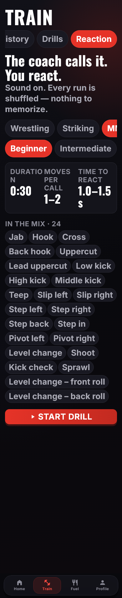

**A1 · P2 · At 200% text the Reaction tab is off-screen, and nothing shows the
row scrolls.** At large text sizes `FilterChips` switches to a horizontal
scroller. With four tabs, "Reaction" starts fully outside the viewport, and
"Drills" ends flush at the screen edge, so the row looks complete. A
large-text user will not find the feature. (The row itself predates this
feature; adding a fourth tab is what made it worse.)
*Fix:* auto-scroll the selected chip into view and add an edge fade when the
row overflows. Alternatively, surface Reaction as a hero card at the top of
the Drills tab and keep three tabs.

---

## B. Picker

| 100% · MMA Beginner | 100% · Wrestling Advanced+ | German 100% | 200% bold |
|---|---|---|---|
| 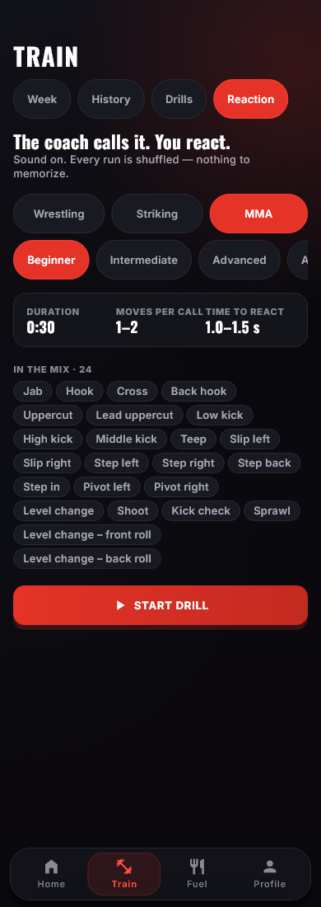 | 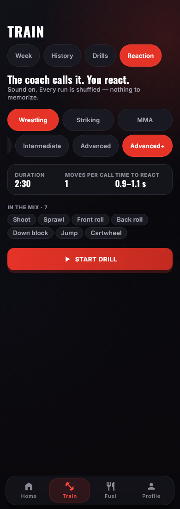 | 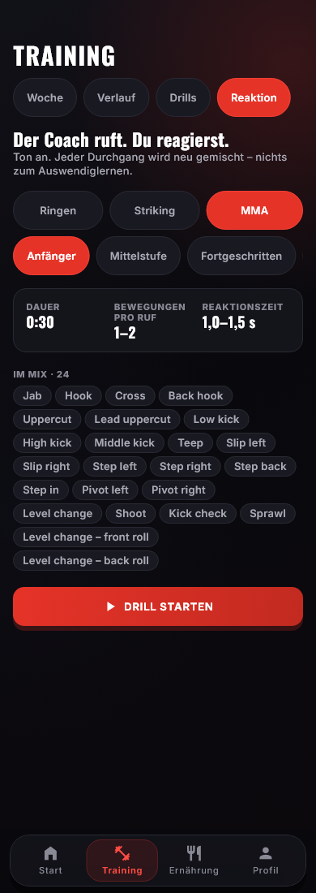 | 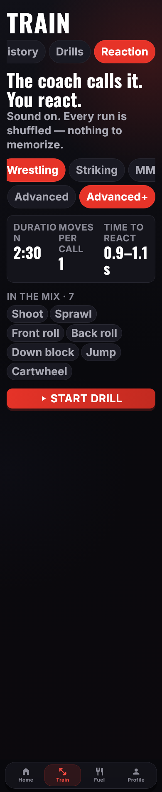 |

**B1 · P1 · The stat card's labels collide, and break mid-word at large text.**
At 100%, "MOVES PER CALL" runs straight into "TIME TO REACT" and reads as one
line. Measured cause: each column is ~109 px, the card has no gutter between
columns, and the label fills the column. At 200%, "DURATIO / N" breaks inside
the word and the "s" of "1.0–1.5 s" is orphaned on its own line.
*Fix:* add an `Insets.md` gutter between columns, shorten the labels
("DURATION · MOVES · REACT"), and stack the three stats vertically when text
scale ≥ 1.4 (the same threshold `FilterChips` already uses).

**B2 · P1 · The level row hides options, and can hide the current selection.**
- English, 100%: the fourth level is cut to a sliver ("A…"). Nothing tells
  the athlete that Advanced+ exists.
- German, 100%: "Fortgeschritten+" is entirely off-screen.
- 200%: only two of the four levels are visible. The *selected* discipline,
  "MMA", is clipped to "MI" at the right edge, so the current choice is
  invisible.

*Fix:* the level has four fixed options, so lay them out as a 2 × 2 grid (or
wrap) instead of a scroller. Always scroll the selected chip into view.

**B3 · P2 · Four identical red pills compete for the one action.** Navigation
tabs, discipline, level, and the Start button all use the same crimson fill.
Navigation looks the same as settings, and "Start drill" is no longer the
screen's single strong action, which the UI contract requires.
*Fix:* give the two setting rows a quieter selected style (outlined, or
`primaryDark`, which also fixes the 4.31:1 chip contrast — see G). Consider
three discipline *cards* using the silhouettes from the coaching sheet, which
would give the screen identity and make the choice feel weightier than a
filter.

**B4 · P2 · The move list is a wall of false buttons.** Twenty-four pills in
the same shape as the tappable chips above them, but tapping does nothing.
This is the same "so much writing" problem the tester raised about EdgeFuel.
*Fix:* collapse it to one line, "24 moves · see list", opening a sheet; or
render the moves as plain muted text, not pills.

**B5 · P2 · There is no way to check the sound before starting.** The hint
says "Sound on," but a muted phone or low volume is the most likely failure
of a voice feature, and the athlete only discovers it after the countdown
while already in stance.
*Fix:* add a "Test voice" button that speaks a sample call for the chosen
level ("Step left, hook!"). It doubles as a preview of how the level sounds.

**B6 · P3 · The selection is not remembered.** Every visit resets to MMA ·
Beginner, although athletes repeat the same drill.

**B7 · P3 · The headline style is inconsistent.** "The coach calls it. You
react." is mixed-case Oswald; every other Oswald heading on the tab is
uppercase ("TRAIN", "WEEK 1").

**B8 · P3 · "Time to react" shows the base window only.** Intermediate's real
recovery after a 3–4-move call is 2.3–3.2 s, and Advanced wrestling adds a
rest every 3–4 calls. Neither appears. The number is not false, but it
undersells what the level feels like.

---

## C. Countdown

| 100% | German 100% | 200% bold |
|---|---|---|
| 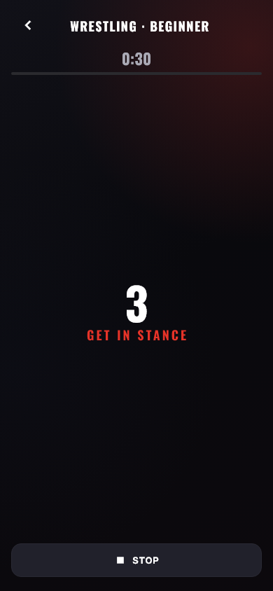 | 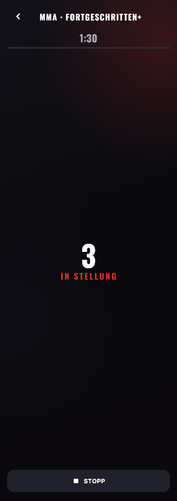 | 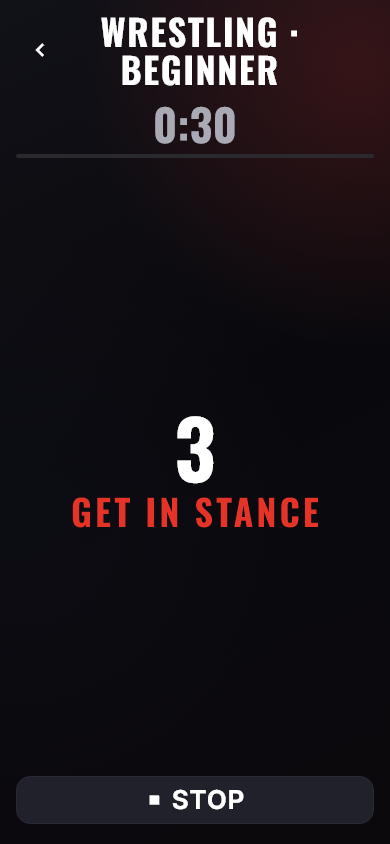 |

**C1 · P2 · The countdown is sized for a hand-held phone.** A 64 pt numeral on
an otherwise empty screen, when the athlete is stepping back into stance.
*Fix:* add a dedicated drill-numeral token (for example 160) and use it for
the countdown. `heroNumeral` is a dashboard object; this is a scoreboard.

**C2 · P3 · The red label breaks the colour rule.** "GET IN STANCE" is 18 pt
text in `AppColors.primary`. It measures 4.61:1 on the plain background, so it
passes AA, but the contract reserves `primary` for fills. Use `accentText`
(6.02:1); the red glow behind the header would otherwise pull it lower.

**C3 · P3 · The German reads oddly.** "IN STELLUNG" is literal. "IN
KAMPFSTELLUNG" or "GRUNDSTELLUNG!" is what a German coach would say; confirm
with the partner in Germany.

---

## D. Live call — the screen the feature exists for

| 1 move | 2 moves | 7 moves | 7 moves, 200% |
|---|---|---|---|
| 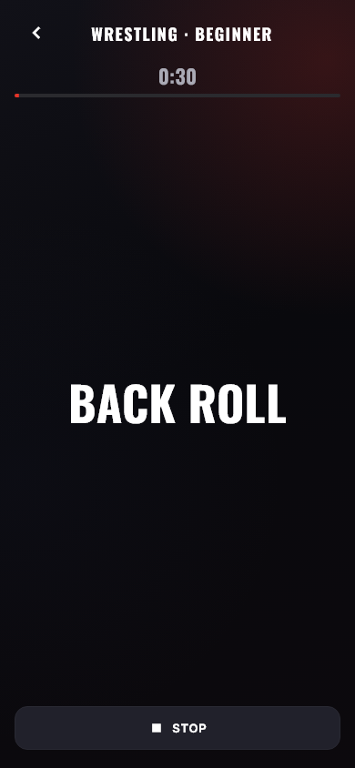 | 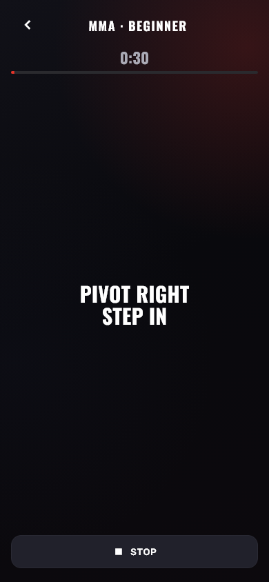 | 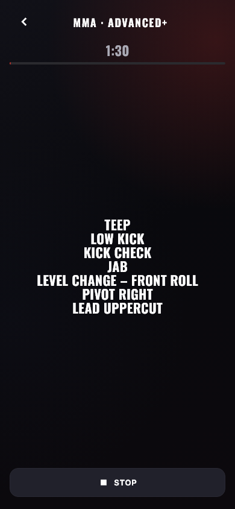 | 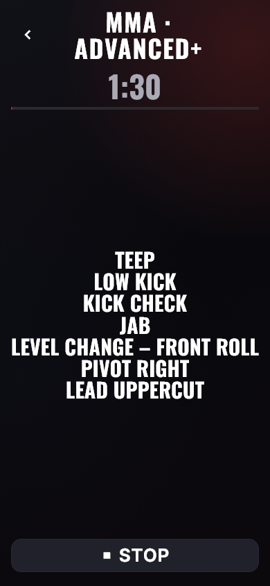 |

**D1 · P1 · Calls get smaller as the drill gets harder.** One move is 52 pt,
two or three moves drop to 30 pt, and four or more drop to 22 pt with tight
line spacing. A seven-move Advanced+ call occupies about a fifth of the screen
in small type, surrounded by empty space. It cannot be read from the floor, at
exactly the level where the athlete most needs a visual backup to the voice.
*Fix:* size the call to fill the space available: scale *up* to fit both
width and height, capped at `display`, with more generous line spacing.
The screen has room for seven lines at roughly 40 pt.

**D2 · P2 · Nothing on screen signals a new call.** The previous call stays up
through the whole reaction gap, and the change is a 160 ms cross-fade (none at
all with reduced motion). In a loud gym, someone glancing at the phone can't
tell whether it's the same call; two consecutive two-move calls can even
share a move.
*Fix:* a short, clear "new call" signal that is not decorative motion — a
call counter ("12") or a one-beat flash of the progress strip. Also dim the
call once its reaction gap has passed.

**D3 · P2 · Sequence order and grouping are not shown.** Moves are an
unlabelled stack, and the compound "LEVEL CHANGE – FRONT ROLL" reads as two
moves.
*Fix:* number or arrow the moves (1 → 2 → 3) and keep a compound move on one
line, with the second part in a lighter weight.

**D4 · P2 · There's no pause, and leaving loses the run.** The only options are
Stop or Back, both of which discard the drill without confirmation. The
controller also ignores app lifecycle: if a phone call interrupts, the drill
keeps running in the background and the athlete returns to "TIME".
*Fix:* pause on `AppLifecycleState.paused`, add Pause/Resume beside Stop, and
confirm leaving mid-drill.

---

## E. Finished

| 100% | 200% bold | German 100% |
|---|---|---|
| 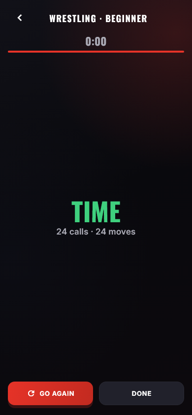 | 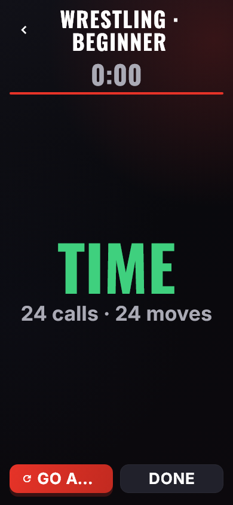 | 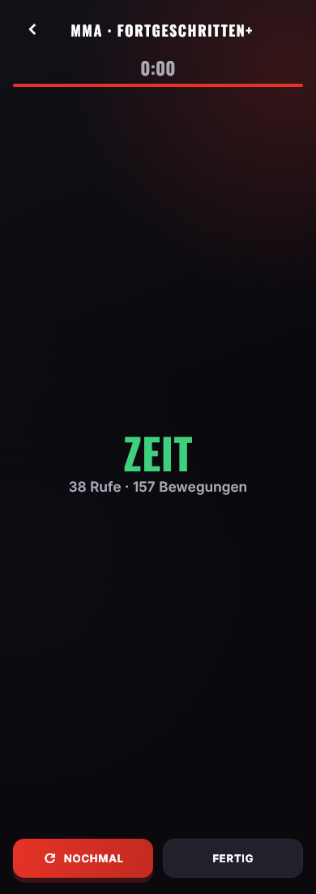 |

**E1 · P2 · A finished drill counts for nothing.** It is not logged, does not
feed the streak, and has no history. The round timer *does* mark a session
complete, so this is inconsistent within the same tab and wastes the app's
best retention hook. "24 calls · 24 moves" is also redundant for wrestling,
where every call is one move.
*Fix:* log it as a training session and credit the streak. Show one useful
line instead of two counts ("24 calls in 0:30 — ready for Intermediate?"),
which gives a natural progression nudge.

**E2 · P2 · The primary button truncates at 200%.** "GO AGAIN" becomes
"GO A…". Two side-by-side buttons should stack at large text sizes.

What works: "TIME" in `positive` green is semantically right (9.97:1) and
unmistakable from across the room.

---

## F. Stopped

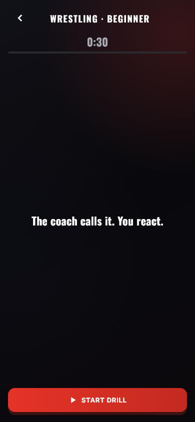

**F1 · P3 · The stopped screen forgets the run.** The clock snaps back to the
full duration and the tagline returns, so the screen is indistinguishable
from never having started. Show "Stopped at 0:12 · 9 calls" above Start.

---

## G. Cross-cutting

**Working well — keep these:**
- Tap targets pass Android's 48 dp and iOS's 44 pt guideline checks, and every
  tap target is labelled (automated guideline tests).
- No overflow anywhere at 200% bold text. Long calls shrink rather than clip.
- Reduced motion is honoured: calls swap instantly.
- The screen stays awake during a drill, and every call is also shown on
  screen, so a muted or deaf athlete can still train.
- Assistive tech hears each call once, as a single spoken line.
- Timer and progress bar stay quiet; the call is the hero, which is the right
  hierarchy.

**Pre-existing, app-wide (not introduced here):** the shared `FilterChips`
selected state is white on `primary`, 4.31:1, under AA's 4.5:1. Switching the
fill to `primaryDark` gives 5.76:1. The accessibility test for it is written
and skipped with this reason. Fixing B3 fixes this too.

---

## Recommended order

1. **D1** — scale calls to fill the screen. Biggest impact on the core job,
   and a small change.
2. **B1 + B2** — stat card gutter and stacking; level row as a 2 × 2 grid.
   Fixes English, German, and 200% at once.
3. **D4** — pause, resume, and lifecycle handling.
4. **B5** — "Test voice" button.
5. **E1** — log the drill and credit the streak; progression nudge.
6. **D2 + D3** — new-call signal; numbered sequences.
7. **B3 / G** — quieter setting chips on `primaryDark`, which also closes the
   contrast issue. This changes goldens app-wide, so do it as its own slice.
8. The remaining P2s: A1 (tab row at large text), B4 (move list), C1
   (countdown size), E2 (stacked buttons).
9. P3 polish: B6–B8, C2, C3, F1.
