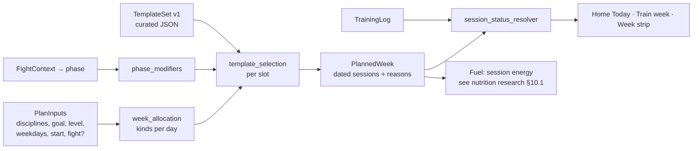

# Training plan: domain and template proposal (2026-10-04)

For owner approval **before** any session-template content is written
(owner constraints 2 and 6). Implements audit tasks 1.1–1.3 and the
session-mode direction. Nothing here invents combat-training methodology:
the engine is rules + curated templates, and the templates are the owner's
(or a coach's) to write.

## 1. Principles

1. **Deterministic.** Same inputs and template set → same week, byte for
   byte. No AI in generation. AI may later *explain* a reason code.
2. **Dated.** Every session has a calendar date. Nothing before the plan
   start counts against the user. No weekday strings in logic.
3. **Every input changes the output** (owner constraint 7), and each
   session records which inputs shaped it (reason codes).
4. **Rest is planned, not missed.** Consistency is measured per week
   against the plan.
5. **Templates are data**, versioned and validated, separate from code.
6. **Fight is optional.** No fight → a general plan that still uses
   discipline, goal, level and days.

## 2. Domain structure (`lib/features/training_plan/domain/`, pure Dart)

```text
training_plan/domain/
  models/
    discipline.dart          enum Discipline { boxing, kickboxing, muayThai, wrestling, bjj, mma }   [owner: list]
    experience_level.dart    enum ExperienceLevel { beginner, intermediate, advanced, competitor }
    training_goal.dart       enum TrainingGoal { competitionPrep, makeWeight, loseFat, buildFitness, improveTechnique, buildMuscle }
    session_kind.dart        enum SessionKind { skill, sparring, conditioning, strength, recovery, gymClass }
    intensity.dart           enum Intensity { light, moderate, hard }
    plan_inputs.dart         PlanInputs(disciplines (priority order), goal, level, weekdays Set<int>,
                                        sessionMinutes?, startDate, fight: FightContext?)
    fight_context.dart       FightContext(fightDate, weighInOffsetDays, phase)  ← from fight_camp/domain
    session_template.dart    SessionTemplate + BlockTemplate (curated data, §3)
    planned_session.dart     PlannedSession(id, date, templateId, templateVersion, kind, discipline?,
                                            intensity, titleKey, blocks: List<PlannedBlock>,
                                            estimatedMinutes, reasons: List<ReasonCode>)
    planned_block.dart       PlannedBlock(kind, rounds, workSec, restSec, drillIds, cueKeys)
    planned_day.dart         PlannedDay(date, type: DayType{training, recovery, rest, weighIn, fight}, sessions)
    planned_week.dart        PlannedWeek(weekStart, days, generatorVersion, templateSetVersion, inputsHash)
    session_status.dart      enum SessionStatus { planned, today, completed, missed, skipped, moved, beforeStart, rest }
  rules/
    week_allocation.dart     which days get which kind (§4)
    phase_modifiers.dart     fight-camp phase → volume/intensity multipliers   [owner: values]
    template_selection.dart  pick a template per slot: discipline × kind × level × intensity, rotate by week
  training_plan_generator.dart   PlannedWeek week(PlanInputs, DateTime weekStart, TemplateSet)
  session_status_resolver.dart   status from PlannedWeek + TrainingLog + today
  consistency/
    weekly_adherence.dart    planned vs done per week (moved counts at new date; rest neutral)
    weekly_streak.dart       consecutive weeks meeting the target; current week alive while still possible
    freeze_rules.dart        freezes cover a missed PLANNED session, never a rest day
  validation/
    template_validation.dart schema + range checks for the template set (like catalog_validation.dart)
```

Data and presentation (not domain):

```text
training_plan/data/       TrainingPlanRepository (Firestore users/{uid}/plan/{weekStartKey}, in-memory),
                          AssetTemplateSet (assets/data/session_templates.json)
training_plan/presentation/
                          TrainingPlanController, Train week screen, SessionPlayer, completion sheet
```

**Log stays the source of truth for what happened.** `TrainingLogEntry`
gains `plannedSessionId`, `durationMin`, `roundsCompleted`. The plan says
what *should* happen; the log says what *did*; the resolver joins them.

### Generation flow



## 3. Session-template structure

Templates live in `assets/data/session_templates.json`, versioned, validated
at load and in tests. Example **shape only**; the content below is a
placeholder to show fields, not a training recommendation:

```json
{
  "templateSetVersion": 1,
  "templates": [
    {
      "id": "boxing.skill.beginner.a",
      "version": 1,
      "kind": "skill",
      "discipline": "boxing",
      "levels": ["beginner"],
      "intensity": "moderate",
      "phases": ["general", "build"],
      "titleKey": "tplBoxingFundamentals",
      "estimatedMinutes": 45,
      "energyMet": 7.0,
      "blocks": [
        { "kind": "warmUp", "minutes": 8, "cueKeys": ["cueWarmUpShadow"] },
        { "kind": "drillRounds", "rounds": 4, "workSec": 180, "restSec": 60,
          "drillSelector": { "discipline": "boxing", "level": "beginner", "tags": ["jab", "cross"] } },
        { "kind": "conditioning", "rounds": 2, "workSec": 60, "restSec": 30, "cueKeys": ["cueFinisher"] },
        { "kind": "coolDown", "minutes": 5 }
      ]
    }
  ]
}
```

| Field | Purpose |
|---|---|
| `id`, `version` | Stable reference from `PlannedSession`; old weeks keep the version they used |
| `kind`, `discipline`, `levels`, `intensity`, `phases` | Selection keys |
| `titleKey`, `cueKeys` | ARB keys (EN/DE), never literal text |
| `estimatedMinutes`, `energyMet` | Shown on Home/Train; feeds Fuel's session energy |
| `blocks` | What session mode plays: warm-up, rounds with timer, drills, cues, cool-down |
| `drillSelector` | Picks drills from the existing drill catalog by discipline/level/tags (so drill progress links to sessions) |

`gymClass` templates have **no blocks**: "Your class at the gym",
duration only. The app logs them and plans around them (see decision 3).

## 4. Allocation rules (proposed defaults; owner to confirm)

| Input | Effect |
|---|---|
| Weekdays chosen (2–6) | Exactly those days get a session; the rest are rest days. Day 0 is the start date, so a Thursday sign-up gets Thu–Sun only in week 1 |
| Disciplines (priority order) | First discipline gets ~50% of skill slots; others share the rest; MMA rotates striking / grappling / MMA-specific |
| Goal | competitionPrep / makeWeight: +1 conditioning slot (if ≥4 days); improveTechnique: skill slots only; buildFitness / loseFat: conditioning + strength share up; buildMuscle: strength on 2 days |
| Level | Selects template levels, rounds and session length; beginners get no sparring templates |
| Fight (optional) | Phase from `fight_camp/domain`: general → build → peak → taper; phase modifiers scale volume/intensity; fight week = light only after the weigh-in rules |
| Spacing | Max 2 hard days in a row; recovery template preferred after 2 hard days if the user chose a 3rd consecutive day |
| Rotation | Template choice rotates weekly within its slot (A/B/C) so weeks differ but stay predictable |

Every rule emits a `ReasonCode`, which the plan reveal turns into one
sentence ("5 sessions because you chose Mon–Fri. Extra conditioning because
you're preparing to compete.").

## 5. Session states and consistency

| State | Rule | Visual (see UI spec) |
|---|---|---|
| beforeStart | date < plan start | Hidden or "before you joined" |
| planned | future, no log | Plain row |
| today | date = today, no log | Promoted, primary action |
| completed | log entry for the session | Tick, RPE, duration |
| missed | past, no log, not skipped/moved | Muted, "Move to today" offered while the week lasts |
| skipped | user skipped with a reason | Muted, neutral (not a failure) |
| moved | user moved it to another date | Shown at the new date; original shows "Moved to Thu" |
| rest | rest/recovery day | Calm row; never at risk |

**Weekly adherence** = completed ÷ planned (moved counted once, at its new
date). **Weekly streak** = consecutive weeks with adherence ≥ the weekly
target (default: all planned, or planned − 1 when ≥5 days: owner decision
8). Rest days are never counted. A freeze can cover one missed planned
session per week. Timer and free sessions count toward minutes and Fuel
energy; whether they can stand in for a planned session is decision 9.

## 6. Session mode (structure only)

`SessionPlayer` plays `PlannedSession.blocks` with the existing
`RoundTimerEngine` (wall clock, keep-awake, voice, haptics):

```text
STRIKING · ROUND 2 OF 6                      (Oswald title, round counter)
DOUBLE JAB → CROSS → EXIT                    (current drill cue, large)
02:37                                        (heroNumeral)
Next: rear kick combination                  (next block/drill)
[ Pause ]                       [ ⏭ Skip ]   (bottom, one-handed)
```

End: "Session complete · 45 min · 6 rounds" → "How hard was it?" (5–10 as
large buttons) → week strip fills one segment, one success haptic → back to
Home in its "done" state. Free timer stays available in Train for
unplanned work.

## 7. Migration from today's template

- Existing `sessions` docs (Mon…Sat template) → infer weekdays and a
  discipline mix; generate the current week from today; keep all log
  history. Old `planSlotId` entries stay valid for history.
- Old daily streak and freezes → converted once: current weekly streak = 1
  if this week is on track, else 0; banked freezes kept.

## 8. Build order (each a PR)

1. Domain models + validator + generator with a **placeholder test-only
   template set** (no real content shipped).
2. Repository, controller, migration; Train week + Home read the planned
   week; weekday-string logic deleted.
3. Weekly consistency engine replaces the daily streak.
4. Onboarding v2 writes `PlanInputs` (saved per step) and the real reveal.
5. Session player with the template blocks.
6. **Real template content**, after the owner approves §9.

Steps 1–5 can ship with a minimal, owner-approved generic set (e.g. one
"skill session" per discipline with no prescribed drills) if real content
isn't ready.

## 9. Owner decisions required

| # | Decision | Proposal | Why it matters |
|---|---|---|---|
| 1 | **Discipline list** | Boxing, Kickboxing, Muay Thai, Wrestling, BJJ, MMA | Onboarding, template selection, drill links |
| 2 | **Who writes templates, and how many for v1** | Owner or a coach. ~40 to start: per discipline 3 skill × 2 level bands, plus 3 conditioning, 2 strength, 1 recovery shared | The methodology is yours, not the code's |
| 3 | **Gym classes** | Add "I train at a gym on these days" → those days become `gymClass` (no prescribed content, logged); the app fills other days with conditioning/strength/skill | Many fighters follow a coach; prescribing striking on their boxing-class night would be wrong |
| 4 | **Sparring** | No sparring templates for beginners; intermediate+ max 1–2/week; none in fight week | Safety and liability |
| 5 | **Session length defaults** | Beginner 45, intermediate 60, advanced/competitor 75 min; user can override | Shown everywhere and feeds Fuel energy |
| 6 | **Fight-camp phase rules** | General >8 wk out; build 8–3; peak 3–1.5; taper last ~10 days (volume ~−40%); weigh-in day light only | Needs coach/expert review |
| 7 | **Week start day** | Monday default, settable | Week strip and weekly streak |
| 8 | **Weekly target** | All planned sessions; with ≥5 planned days, planned − 1 still counts | How forgiving consistency is |
| 9 | **Free timer / Reaction** | Timer sessions ≥20 min can fill a missed planned slot of the same day; Reaction is skill-only, never counts as a session | Avoids gaming, keeps credit fair |
| 10 | **Missed sessions** | Mark missed; offer "Move to today" if today has no session; never auto-shift | User stays in control (constraint 3 spirit) |
| 11 | **Two sessions a day** | Not in v1 | Keeps Home's Today state simple |
| 12 | **MET table** for session energy (nutrition §10.1) | Conservative table per kind × intensity, reviewed by a dietitian/coach | Directly changes calorie targets |
